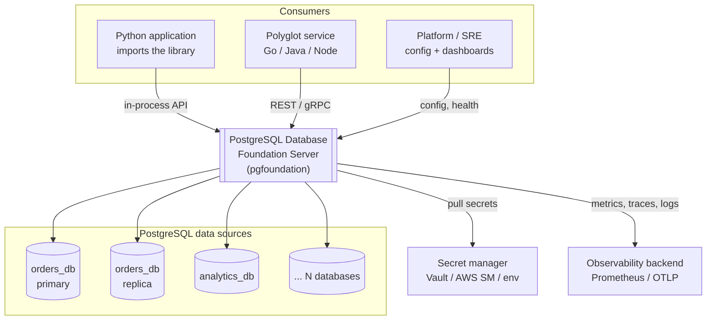
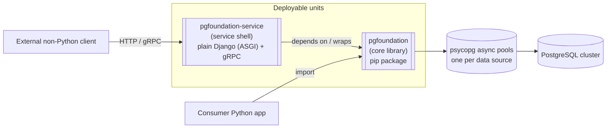
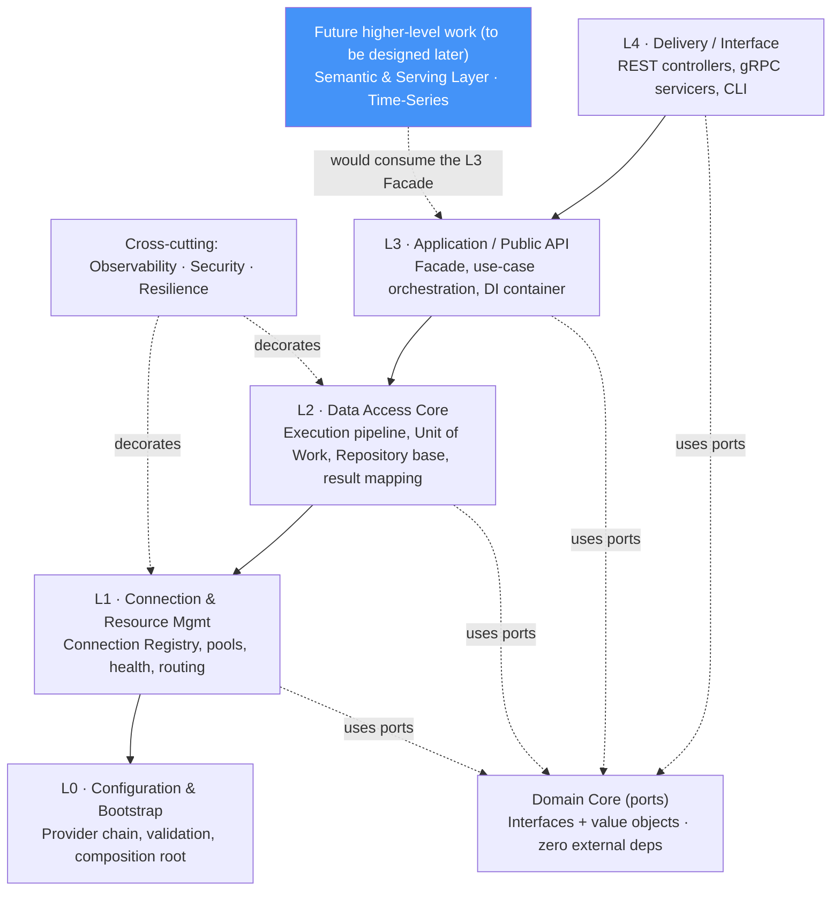
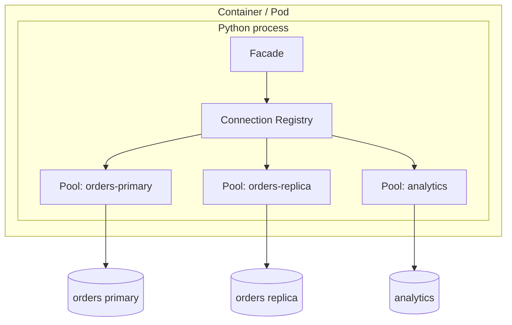

# 02 — Architecture Overview

## 2.1 Architectural style

The system combines two complementary styles:

- **Hexagonal architecture (Ports & Adapters)** — the core defines *ports*
  (interfaces); everything external (the psycopg driver, config sources, the
  REST/gRPC transport, metrics backends) is an *adapter* plugged into a port.
  This is what makes the system decoupled and testable (Requirement 7 & 5).
- **Layered / Clean architecture** — dependencies point **inward only**. Outer
  layers know about inner layers; inner layers know *nothing* about outer ones.
  The domain core has zero third-party imports.

> **The dependency rule:** source-code dependencies always point toward the
> center. `psycopg`, `django` (the shell), `pydantic`, and the process's
> environment are all *details* at the edges, never in the core.

## 2.2 C4 — Level 1: System Context

## 2.3 C4 — Level 2: Containers

**Key point:** the service shell is *just another consumer* of the library. It
adds a transport and auth skin; it holds **no** data-access logic of its own.
This guarantees behavioral parity between the two delivery modes.

## 2.4 The layer stack

From outermost (edge) to innermost (core):

> **Future higher-level work would consume the L3 Facade** — it is **not** part of
> the foundation. The **Semantic & Serving Layer** and a **Time-Series** capability
> are **deferred (to be designed later)**; the foundation only exposes generic
> **seams** (composable `QuerySpec`, materialized-view lifecycle, access-filter
> hook, `DriverPort`, pluggable interval bucketing) so that future work needs no
> core change.

Each layer is documented in [03 — Layered Design](./03-layered-design.md).

| Layer | Responsibility | May depend on | Must NOT know about |
|-------|----------------|---------------|---------------------|
| **Core (ports)** | Interfaces, value objects, errors | nothing (stdlib only) | psycopg, django, env |
| **L0 Config** | Load & validate configuration | Core | data-access details |
| **L1 Connection** | Own pools & registry | Core, L0 | HTTP, use-cases |
| **L2 Access** | Execute, transact, map | Core, L1 | HTTP, config sources |
| **L3 App/API** | Facade, orchestration, DI | Core, L1, L2, L0 | HTTP framework specifics |
| **L4 Delivery** | REST/gRPC/CLI transport | L3 (Facade only) | L1/L2 internals |
| **Cross-cutting** | Logging, metrics, tracing, retry, auth | Core | — (wraps via decorators) |
| *(deferred, higher-level)* | Semantic & Serving, Time-Series — **not** foundation layers; to be designed later | the L3 Facade (as a dependency) | L1/L2 internals |

## 2.5 Why this shape satisfies the requirements

| Requirement | How the architecture delivers it |
|-------------|----------------------------------|
| **1. Multiple connections** | L1 Connection Registry holds N named data sources, each independently pooled/tuned. |
| **2. Infra / low-level** | The library has no business logic; it is a foundation others build on. |
| **3. No hard-coding** | L0 externalizes *every* value through a provider chain (env/file/secret). |
| **4. Performance** | Async-first psycopg pools, prepared statements, pipelining, COPY — see [09](./09-performance.md). |
| **5. Design patterns** | Ports/Adapters, Registry, Factory, Strategy, UoW, Repository, Facade, Decorator, DI — see [04](./04-design-patterns.md). |
| **6. Reusable *APIs*** | L3 exposes a **curated set of reusable basic APIs** (read/write/transaction/stream/interval/bulk/admin — [11 §11.4a](./11-public-api-reference.md)); internals stay private. One import, many building blocks. |
| **7. Decoupled layers** | Strict inward dependency rule; ports isolate every layer boundary. |
| **N1. Dynamic semantic layer** | **Deferred — to be designed later**; the foundation exposes the generic seams a future semantic layer would need. |
| **N2. Support semantic case, no hard-coding, patterns, clean code** | The foundation provides generic **seams** (composable `QuerySpec`, MV lifecycle, access-filter hook) so a future semantic layer plugs in with no core change. |
| **N3. Flexible development** | Future higher-level requirements change *their own* metadata/models; the stable L3 data contract underneath is untouched. |
| **N4. Streaming & interval fetching** | L2 server-side cursors + `IntervalQuery` bucketing + keyset/watermark incremental fetch; streaming ingest (`COPY`/`LISTEN`) and delivery (SSE/gRPC/Arrow) — see [16](./16-streaming-and-interval-fetching.md). |
| **N5. API AuthN/AuthZ seam** | Shell exposes `AuthenticatorPort`/`AuthorizerPort` with no-op defaults — **disabled by default**, real impl from a separate project — see [08 §8.5.1](./08-service-shell.md), [ADR-013](./adr/ADR-013-auth-pluggable-seam.md). |
| **N6. Observability integration** | Instrument via `LoggerPort`/`MetricsPort`/`TracerPort` + no-op defaults; the **pipeline is integrated from a separate log project**, not built here — see [10 §10.1](./10-observability-security-resilience.md), [ADR-014](./adr/ADR-014-observability-external-integration.md). |

## 2.6 Runtime topology (typical)

The **library mode** collapses this into the consumer's own process; the
**service mode** runs it as a standalone process fronted by plain Django (ASGI)/gRPC. In
both cases the internal object graph is identical.
