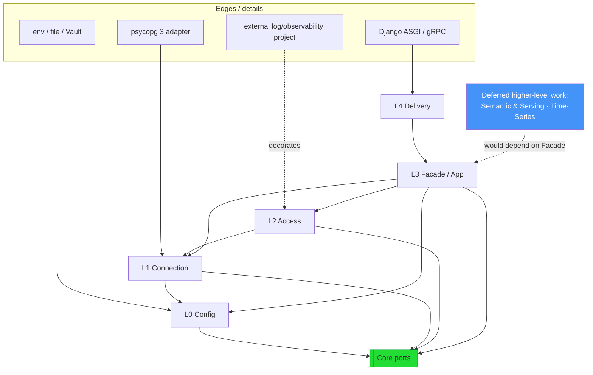

# 03 — Layered Design

This document details each layer: its responsibility, its **ports** (contracts),
and its dependency rules. Ports are shown as Python-ish `Protocol`/ABC
signatures — illustrative, not final.

> **Golden rule:** a layer may only import from layers *below* it and from the
> **Core ports**. Nothing imports *upward*. Enforced in CI via an import-linter
> contract (see [13 — Testing](./13-testing-strategy.md)).

---

## 3.0 Core (Ports & Domain) — the center

Pure Python, standard library only. Defines the vocabulary everyone else speaks.

**Contents**

- **Value objects:** `DataSourceName`, `Dsn`, `QuerySpec`, `Row`, `ResultSet`, `IsolationLevel`, `PoolPolicy`, `RetryPolicy`.
- **Error hierarchy:** `PgFoundationError` → `ConfigError`, `ConnectionError`, `PoolTimeoutError`, `QueryError`, `TransactionError`, `IntegrityError`, `TransientError` (retry-eligible) vs `PermanentError`.
- **Ports (interfaces):**

```python
class ConfigProvider(Protocol):
    def get(self, key: str) -> str | None: ...
    def snapshot(self) -> Mapping[str, str]: ...

class ConnectionPort(Protocol):
    async def execute(self, spec: QuerySpec) -> ResultSet: ...
    async def stream(self, spec: QuerySpec) -> AsyncIterator[Row]: ...
    async def begin(self, isolation: IsolationLevel) -> "TransactionPort": ...

class TransactionPort(Protocol):
    async def execute(self, spec: QuerySpec) -> ResultSet: ...
    async def commit(self) -> None: ...
    async def rollback(self) -> None: ...

class PoolPort(Protocol):
    async def acquire(self) -> ConnectionPort: ...
    async def release(self, conn: ConnectionPort) -> None: ...
    async def health(self) -> HealthStatus: ...
    async def close(self) -> None: ...

class DriverPort(Protocol):
    """The seam that isolates psycopg (and any other PostgreSQL-compatible driver)."""
    def build_pool(self, dsn: Dsn, policy: PoolPolicy) -> PoolPort: ...

class ClockPort(Protocol): ...        # injectable time — no Date.now() in core logic
class SecretResolverPort(Protocol): ...

# Observability seams — the foundation *emits* through these; an external log
# project binds the pipeline. Default no-ops (Null Object). See ADR-014.
class LoggerPort(Protocol): ...       # structured log events
class MetricsPort(Protocol): ...      # counters / gauges / histograms
class TracerPort(Protocol): ...       # spans + context propagation
```

**Why this matters:** because the core owns these interfaces, every outer
component is swappable. The psycopg dependency lives *only* behind `DriverPort`.
Any other PostgreSQL-compatible driver — including one a future time-series
capability might use — implements the *same* `DriverPort` and plugs in with zero
core changes (G8).

---

## 3.1 L0 — Configuration & Bootstrap

**Responsibility:** turn the outside world's raw configuration into validated,
typed, immutable settings objects — and wire the whole object graph (the
*composition root*).

**Ports implemented / consumed:** `ConfigProvider`, `SecretResolverPort`.

**Key components**

- `LayeredConfigProvider` — Chain-of-Responsibility over ordered providers (env → file → secret manager → defaults).
- `Settings` models (Pydantic) — `AppSettings`, `DataSourceSettings`, `PoolSettings`, `ObservabilitySettings`.
- `CompositionRoot` / DI container — the *only* place that knows concrete classes; assembles `Registry`, adapters, decorators.

Detailed in [05 — Configuration](./05-configuration.md).

**Depends on:** Core only. **Never** touched by request-path code — it runs once at bootstrap.

---

## 3.2 L1 — Connection & Resource Management

**Responsibility:** own the lifecycle of every PostgreSQL connection pool and
route logical data-source names to the right pool.

**Ports:** implements `PoolPort`; consumes `DriverPort`.

**Key components**

- `ConnectionRegistry` — a **Registry** of `DataSourceName → PoolPort`. The heart of "multiple connections" (Requirement 1).
- `PoolFactory` — an **Abstract Factory** that builds pools from `DriverPort` + `PoolPolicy`.
- `HealthMonitor` — periodic liveness checks; publishes events (**Observer**).
- `RoutingPolicy` (extension) — primary/replica read-write split, per-data-source.

Detailed in [06 — Connection Management](./06-connection-management.md).

**Depends on:** Core, L0. Knows nothing about SQL execution semantics, HTTP, or use-cases.

---

## 3.3 L2 — Data Access Core

**Responsibility:** execute queries and manage transactions correctly, safely,
and observably — the workhorse layer.

**Ports:** consumes `PoolPort`, `ConnectionPort`, `TransactionPort`.

**Key components**

- `ExecutionPipeline` — a **Template Method** / **Decorator** chain:
  `validate → bind params → acquire → [retry][circuit-breaker][metrics][tracing] → execute → map → release`.
- `UnitOfWork` — a context manager that owns a transaction boundary (**Unit of Work**).
- `Repository` base + `Query`/`Command` separation (light **CQRS**).
- `ResultMapper` — maps raw rows to `dict`, `tuple`, dataclass, or user model (**Strategy**).
- `QuerySpec` builder — safe parameterized SQL (**Builder**); *never* string-concatenates user input.

Detailed in [07 — Data Access & Transactions](./07-data-access-and-transactions.md).

**Depends on:** Core, L1. Knows nothing about HTTP or config sources.

---

## 3.4 L3 — Application / Public API

**Responsibility:** present the **single, stable, minimal public surface** and
orchestrate use-cases across data sources. This is the *only* package external
Python code imports (Requirement 6).

**Key components**

- `DataFoundation` **Facade** — `datasource(name)`, `session()`, `transaction()`, `execute()`, `query()`, `health()`.
- `DataSourceHandle` — a per-data-source ergonomic wrapper returned by the facade.
- Application services / use-case coordinators for cross-data-source operations (e.g. saga-style orchestration, if needed).
- The **DI wiring surface** consumers call at startup: `DataFoundation.from_config(...)`.

Detailed in [11 — Public API Reference](./11-public-api-reference.md).

**Depends on:** Core, L2, L1, L0. Exposes *only* Core value objects & the Facade — never psycopg types.

---

## 3.4.5 Higher-level work is *not* a foundation layer (deferred)

A future **Semantic & Serving Layer** (metric registry, compiler, policy,
aggregate planning, serving) and a **Time-Series** capability are **higher-level
concerns to be designed later** — they would *consume the L3 Facade as a
dependency*, not become layers of the foundation. Analytics semantics (what a
metric means, which rollup satisfies it) and query-planning are things a
domain-agnostic foundation must not carry.

The foundation's obligation now (requirement **N2**) is only to expose clean,
generic **seams** so that future work plugs in with **zero foundation changes**:

- composable `QuerySpec` + safe parameterization ([07 §7.2](./07-data-access-and-transactions.md)),
- query execution + result shaping ([07 §7.3](./07-data-access-and-transactions.md)),
- **materialized-view lifecycle** (`CREATE`/`REFRESH` as plain SQL, [12 §12.9](./12-project-structure-and-packaging.md)) — the foundation *executes/manages* MVs; the *decision* of which to use is a higher-level concern,
- an **access-filter decorator hook** ([10 §10.2](./10-observability-security-resilience.md)).

---

## 3.5 L4 — Delivery / Interface (Service Shell)

**Responsibility:** expose the L3 Facade over a network transport for polyglot
consumers. **Optional** — absent in pure-library deployments.

**Key components**

- Plain **Django (ASGI)** app: async views, Pydantic request/response schemas, apispec/openapi-core OpenAPI, auth middleware.
- gRPC servicers (optional, high-throughput path).
- CLI (`pgfoundation ...`) for ops tasks (health, config-check, warmup).
- Maps transport errors ↔ Core error hierarchy; enforces authN/Z; adds rate limiting.

Detailed in [08 — Service Shell](./08-service-shell.md).

**Depends on:** L3 Facade **only**. It must not import L1/L2 internals — enforced by import-linter.

---

## 3.6 Cross-cutting concerns

These are **not** a layer; they are **decorators/adapters** woven through L1–L2
via the ports, configured at the composition root:

- **Observability** — the foundation *instruments* via `LoggerPort`/`MetricsPort`/`TracerPort` decorators wrapping the execution pipeline, and **integrates an external log/observability project** for the pipeline (exporters, dashboards, storage). It does **not** build the pipeline itself; default is no-op ([ADR-014](./adr/ADR-014-observability-external-integration.md)).
- **Security** — secret resolution (L0), least-privilege DSNs, statement-level audit, TLS enforcement.
- **Resilience** — retry (with jittered backoff), circuit breaker, timeouts, bulkheads — decorators around `ConnectionPort.execute`.

Detailed in [10 — Observability, Security & Resilience](./10-observability-security-resilience.md).

---

## 3.7 End-to-end dependency diagram



Arrows point in the **allowed dependency direction**. The core is depended upon
by all; it depends on none. This is the structural guarantee behind
"clearly decoupled layers."
