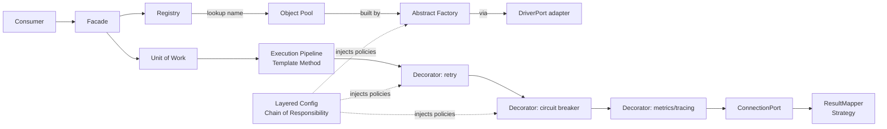

# 04 — Design Patterns Catalog

Every pattern below is used deliberately to satisfy a requirement — not for
decoration. Patterns are the *mechanism* by which "decoupled layers,"
"no hard-coding," and "reusable API only" become real.

## 4.1 Structural / architectural patterns

| Pattern | Where | Problem it solves |
|---------|-------|-------------------|
| **Ports & Adapters (Hexagonal)** | Whole system | Isolates the core from psycopg, the Django shell, config sources. The primary decoupling mechanism. |
| **Layered / Clean Architecture** | Whole system | Enforces one-directional dependencies (Requirement 7). |
| **Facade** | L3 `DataFoundation` | Presents one small surface; hides all internals (Requirement 6). |
| **Adapter** | psycopg driver, config providers, metrics | Wrap third-party APIs behind Core ports. |
| **Composition Root / Dependency Injection** | L0 bootstrap | All wiring in one place; no service locates its own deps → testable, no hard-coding. |

## 4.2 Creational patterns

| Pattern | Where | Problem it solves |
|---------|-------|-------------------|
| **Abstract Factory** | `PoolFactory`, `DriverPort.build_pool` | Create pools/connections without the caller knowing the concrete driver. Enables swapping drivers (e.g. a future time-series adapter). |
| **Factory Method** | `ResultMapper.for(target_type)` | Choose a mapping strategy per call site. |
| **Builder** | `QuerySpec` builder | Assemble safe, parameterized queries step-by-step; no string concatenation of user input. |
| **Registry** | `ConnectionRegistry` | Central lookup of N named data sources (Requirement 1). |
| **Object Pool** | psycopg `AsyncConnectionPool` (adapter) | Reuse expensive connections → performance (Requirement 4). |

## 4.3 Behavioral patterns

| Pattern | Where | Problem it solves |
|---------|-------|-------------------|
| **Strategy** | Config providers, retry policy, result mapping, routing (primary/replica) | Swap algorithms at runtime via config — no code edits (Requirement 3). |
| **Chain of Responsibility** | `LayeredConfigProvider` | Resolve a key across env → file → secret → default. |
| **Template Method** | `ExecutionPipeline` | Fixed execution skeleton; steps vary. |
| **Decorator** | retry, circuit-breaker, metrics, tracing, audit around `ConnectionPort.execute` | Add cross-cutting behavior without touching core logic. Stackable & config-ordered. |
| **Unit of Work** | `UnitOfWork` | Group operations into one atomic transaction boundary. |
| **Repository** | `Repository` base | Give consumers a collection-like abstraction over SQL, decoupled from the driver. |
| **Observer / Pub-Sub** | `HealthMonitor` events, pool state changes | Notify observability & circuit breakers of state transitions. |
| **Command / CQRS-lite** | `Query` vs `Command` split | Route reads to replicas, writes to primary; clearer intent. |
| **Circuit Breaker** | Resilience decorator | Stop hammering an unhealthy database; fail fast. |
| **Context Manager (RAII)** | sessions, transactions, pools | Deterministic acquire/release even on error (Python idiom for resource safety). |
| **Null Object** | `NoopMetrics`, `NoopTracer` | Observability is optional without `if metrics is not None` littering the code. |

## 4.4 Concurrency & resource patterns

| Pattern | Where | Problem it solves |
|---------|-------|-------------------|
| **Bulkhead** | Per-data-source pools with independent limits | One database's overload can't starve the others. |
| **Backpressure / Bounded queue** | Pool `max_size` + acquire timeout | Prevent unbounded connection growth under load. |
| **Async/await pipeline** | Whole L2 | Maximize throughput on I/O-bound DB work (Requirement 4). |

## 4.5 How the patterns interlock (the "money" diagram)

## 4.5.1 Patterns behind the semantic-layer *seams*

A future **Semantic & Serving Layer** (with its own patterns — Registry,
Interpreter, Specification, Visitor, Chain of Responsibility, etc.) is a
**deferred, higher-level concern to be designed later**. Those patterns are
**not** foundation patterns.

The foundation only provides the generic **seams** such a layer would build on,
and the patterns behind those seams are already in this catalog:

| Foundation seam (for a future semantic layer) | Pattern already used |
|-----------------------------------------------|----------------------|
| Composable `QuerySpec` + safe parameterization | **Builder** (§4.2) |
| Query execution + result shaping | **Strategy** (§4.3, result mapping) |
| Materialized-view `CREATE`/`REFRESH` as plain SQL | **Command** (via the execution API) |
| Access-filter injection point | **Decorator** (§4.3) |

So the foundation adds **no new patterns** for the semantic layer — it reuses the
ones it already has.

## 4.5.2 Patterns added by Streaming & Interval Fetching

The streaming / interval capabilities ([16](./16-streaming-and-interval-fetching.md))
add these, all backpressure- and resource-safe:

| Pattern | Where | Problem it solves |
|---------|-------|-------------------|
| **Iterator / Generator** | `stream()`, `interval()` async iterators | Lazy, uniform pull over large/continuous sets |
| **Producer–Consumer (bounded queue)** | DB fetch ↔ consumer | Backpressure; constant memory |
| **Cursor / Keyset pagination** | `fetch_since()` | Constant-time deep/interval pagination (no `OFFSET`) |
| **Memento / Checkpoint** | `WatermarkCursor` | Resumable, idempotent incremental fetch |
| **Strategy** | Pluggable interval bucketing, delivery format | Behavior by capability/config, not branches (a future time-series capability could supply a TimescaleDB bucketing Strategy) |
| **Observer / Pub-Sub** | `LISTEN/NOTIFY` + auto-resubscribe | Push change streams |
| **Template Method** | The fetch-loop skeleton | Fixed loop, varying steps |
| **Adapter (deferred)** | CDC/logical replication, Arrow | Isolate optional/heavy deps behind ports |

## 4.6 Anti-patterns we explicitly avoid

- **Service Locator / global singletons for state** — replaced by explicit DI at the composition root. (A single *facade instance* is fine; hidden global mutable state is not.)
- **God object** — no "Manager" that does everything; responsibilities split by layer.
- **Leaky abstractions** — psycopg types never cross the Facade boundary; consumers see only Core value objects.
- **Stringly-typed config** — all config validated into typed Pydantic models at bootstrap; invalid config fails fast, loudly.
- **Hidden hard-coding** — no magic numbers for pool sizes, timeouts, retry counts; all are config with documented defaults (Requirement 3).

## 4.7 Pattern → Requirement traceability

| Requirement | Primary patterns serving it |
|-------------|-----------------------------|
| 1 · Multiple connections | Registry, Abstract Factory, Bulkhead |
| 2 · Infra / low-level | Ports & Adapters, Layered Architecture |
| 3 · No hard-coding | Strategy, Chain of Responsibility, Dependency Injection |
| 4 · Performance | Object Pool, async pipeline, Decorator (only pay for what's enabled) |
| 5 · Design patterns | *this whole document* |
| 6 · Reusable API only | Facade, Adapter |
| 7 · Decoupled layers | Ports & Adapters, Layered Architecture, DI |
| N1 · Dynamic semantic layer / search | *Deferred — to be designed later* |
| N2 · Semantic case (foundation seams), no hard-coding | Builder + Strategy + Command + Decorator (the seams; §4.5.1) |
| N3 · Flexible development | Metadata lives in the separate project; foundation contract stays stable |
| N4 · Streaming & interval fetching | Iterator/Generator, Producer–Consumer, Keyset/Cursor, Memento (watermark), Strategy (bucketing), Observer (NOTIFY) |
