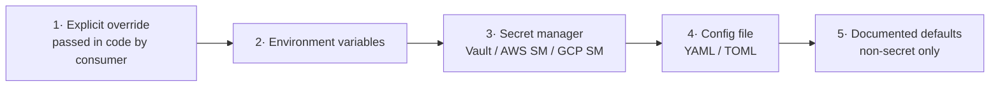
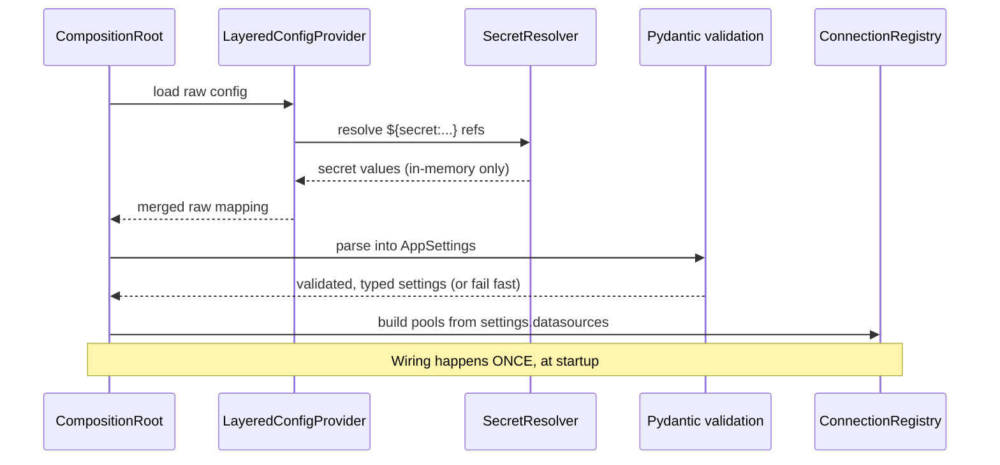

# 05 — Configuration Management ("No Hard-Coding")

Requirement 3 — *"It should not include any hard-coded code"* — is treated as a
first-class architectural constraint, not an afterthought. This document defines
how **every** operational value enters the system from the outside.

## 5.1 Definition of "no hard-coding"

We hold ourselves to this rule:

> **No DSN, host, port, database name, username, password, pool size, timeout,
> retry count, feature flag, or endpoint appears as a literal in source code.**
> Source code may only contain *documented defaults* for non-secret tunables,
> and even those are overridable without editing code.

Secrets (passwords, tokens) have a stricter rule: they may **never** have a
default and **never** be logged.

## 5.2 Configuration source chain (Chain of Responsibility)

Values are resolved by asking an ordered chain of providers; **first hit wins**.
Higher-priority sources override lower ones.



| Priority | Provider | Typical use | Secrets? |
|----------|----------|-------------|----------|
| 1 | Programmatic override | Tests, embedding apps | allowed |
| 2 | Environment variables | 12-factor deploys | discouraged for secrets |
| 3 | Secret manager | Passwords, TLS keys | **preferred** |
| 4 | Config file (YAML/TOML) | Structure: which data sources exist, pool tuning | **no secrets** |
| 5 | Defaults in code | Safe fallbacks for tunables | never |

Each provider implements the Core `ConfigProvider` port; the chain is a
`LayeredConfigProvider`. Adding a new source (e.g. Consul) = new adapter, no core change.

## 5.3 Typed, validated settings (fail fast)

Raw strings from the chain are parsed into **immutable Pydantic models** at
bootstrap. Invalid configuration aborts startup with a precise message — it never
fails deep in the request path.

```python
class PoolSettings(BaseModel):
    min_size: int = 1
    max_size: int = 10               # documented default, overridable
    max_idle_seconds: float = 300.0
    acquire_timeout_seconds: float = 5.0
    max_lifetime_seconds: float = 1800.0

class DataSourceSettings(BaseModel):
    name: str
    dsn: SecretStr                    # resolved from secret manager; never logged
    role: Literal["primary", "replica", "standalone"] = "standalone"
    pool: PoolSettings = PoolSettings()
    statement_timeout_ms: int | None = None
    prepared_statements: bool = True
    read_only: bool = False

class AppSettings(BaseModel):
    datasources: list[DataSourceSettings]      # ← multiple connections declared here
    observability: ObservabilitySettings = ObservabilitySettings()
    resilience: ResilienceSettings = ResilienceSettings()

    @field_validator("datasources")
    @classmethod
    def _names_unique(cls, v): ...             # reject duplicate names at boot
```

## 5.4 Declaring multiple data sources (example config file)

Structure lives in a file; **secrets are references**, resolved at runtime.

```yaml
# pgfoundation.yaml  — structure & tunables only, NO secrets
datasources:
  - name: orders-primary
    role: primary
    dsn: ${secret:orders/primary/dsn}     # resolved via secret manager
    pool: { min_size: 2, max_size: 20, acquire_timeout_seconds: 3 }
    statement_timeout_ms: 5000

  - name: orders-replica
    role: replica
    dsn: ${secret:orders/replica/dsn}
    read_only: true
    pool: { min_size: 2, max_size: 40 }

  - name: analytics
    role: standalone
    dsn: ${env:ANALYTICS_DSN}             # or from env for local dev
    pool: { min_size: 1, max_size: 8 }

observability:                           # integrate an EXTERNAL log project — not built here (ADR-014)
  provider: none                         # DEFAULT no-op; e.g. "otel" or the log project's adapter
  metrics: { enabled: false }            # emit via MetricsPort when a provider is bound
  tracing: { enabled: false, sample_ratio: 0.1 }
  # exporter/collector/dashboard config lives in the external log project, not here

resilience:
  retry: { max_attempts: 3, base_backoff_ms: 50, max_backoff_ms: 1000, jitter: true }
  circuit_breaker: { failure_threshold: 5, reset_timeout_seconds: 30 }

auth:                                    # service-shell auth seam (see 08 §8.5.1)
  enabled: false                         # DEFAULT — no AuthN/AuthZ enforced; real impl from a separate project
  # provider: pgfoundation_auth.Provider # set only when a separate auth project is integrated
```

> When `auth.enabled: true`, the shell requires a registered auth provider or it
> **fails closed** at startup. Production profiles should set `enabled: true`
> ([ADR-013](./adr/ADR-013-auth-pluggable-seam.md)).

The `${secret:...}` and `${env:...}` interpolation is handled by the provider
chain — the file itself never holds a credential.

## 5.5 Environment-variable convention

For pure 12-factor deploys, everything can be expressed via env with a stable prefix:

```
PGF__DATASOURCES__0__NAME=orders-primary
PGF__DATASOURCES__0__DSN=postgresql://...        # (prefer secret manager)
PGF__DATASOURCES__0__POOL__MAX_SIZE=20
PGF__OBSERVABILITY__METRICS__ENABLED=true
```

Double-underscore `__` denotes nesting (Pydantic-settings convention).

## 5.6 Configuration lifecycle



## 5.7 Runtime reconfiguration (optional, v2)

- **Hot-reload of non-secret tunables** (pool sizes, timeouts) via a `ConfigWatcher` that re-emits settings and asks the Registry to resize pools — without restart.
- **Secret rotation:** DSN secrets can be re-resolved on a schedule; pools drain-and-rebuild gracefully.
- These are additive; v1 loads once at startup.

## 5.8 Security rules for configuration

1. Secrets resolve into `SecretStr`; `repr`/logs show `**********`.
2. No secret is ever written to a config file committed to git.
3. `pgfoundation config check` (CLI) validates config **without** printing secret values.
4. TLS parameters (sslmode, root cert path) are config, defaulting to `sslmode=verify-full` in production profiles.
5. Least-privilege: each data source's DSN should use a role scoped to only what that consumer needs — enforced by convention + documented.

## 5.9 Why this satisfies Requirement 3

- The **only** literals in code are safe, documented, non-secret defaults — and every one is overridable through the chain.
- Adding/removing a database, retuning a pool, or rotating a credential requires **zero code changes** — just config.
- Invalid or missing required config fails **loudly at boot**, never silently with a baked-in fallback.
