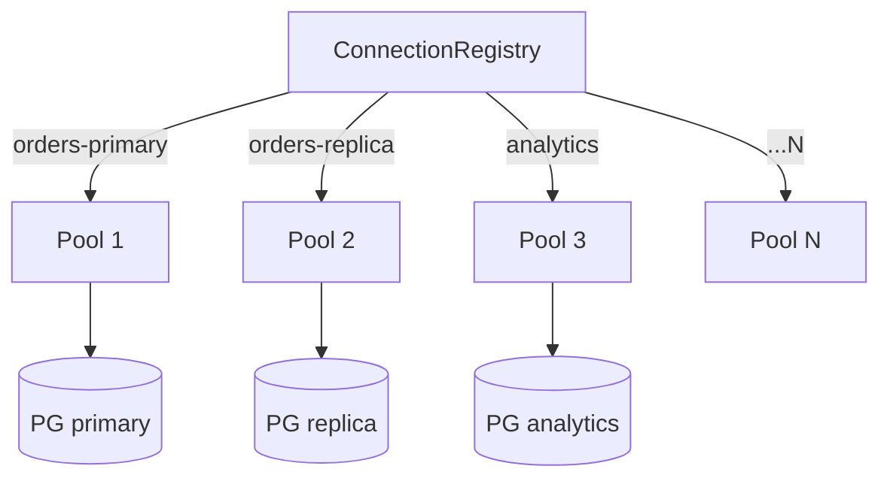
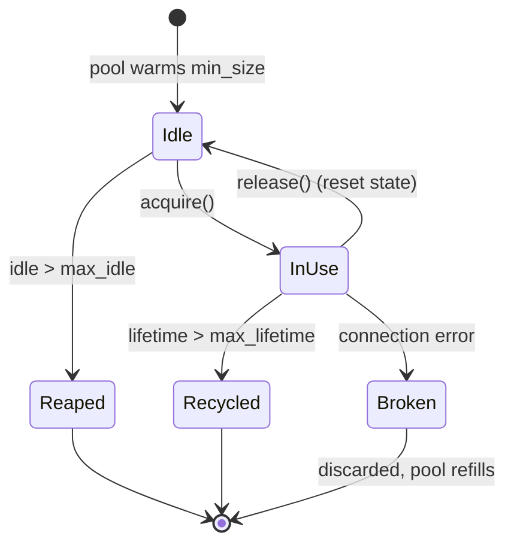
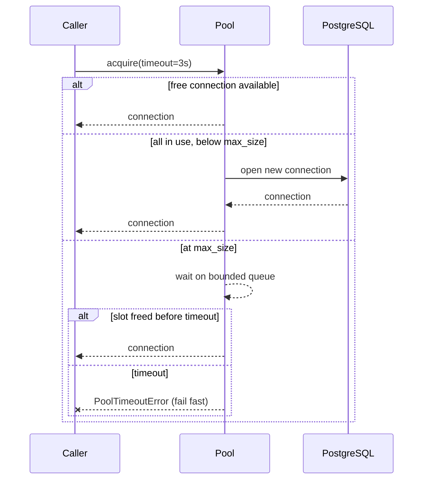
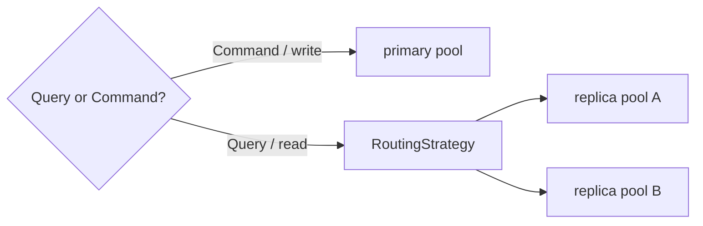

# 06 — Connection Management (Multiple PostgreSQL Databases)

This is the layer that makes Requirement 1 — *"support multiple PostgreSQL
database connections"* — real, and the layer most responsible for Requirement 4
(performance) via pooling.

## 6.1 Core concepts

| Concept | Definition |
|---------|------------|
| **Data source** | A logical, named PostgreSQL target with its own DSN, pool, and policies. |
| **Connection Registry** | The single object that owns *all* data sources and resolves a name → pool. |
| **Pool** | A bounded, reusable set of live connections for one data source (object pool). |
| **Routing** | Choosing *which* pool a query goes to (by name, and optionally by read/write intent). |

## 6.2 The Connection Registry (Registry pattern)

```python
class ConnectionRegistry:
    """Owns every data-source pool. The only place pools live."""
    def __init__(self, factory: PoolFactory): ...

    def register(self, settings: DataSourceSettings) -> None: ...
    def get(self, name: DataSourceName) -> PoolPort: ...          # O(1) lookup
    def names(self) -> list[DataSourceName]: ...
    async def start(self) -> None: ...   # open all pools (or lazily on first use)
    async def aclose(self) -> None: ...  # drain & close all pools
    async def health(self) -> dict[str, HealthStatus]: ...
```

- Built **once** at the composition root from `AppSettings.datasources`.
- Keyed by the logical name (`"orders-primary"`), *not* by DSN — so consumers reference stable names, and the underlying DSN can change via config.
- Thread-/task-safe: registration happens at bootstrap; the request path is read-only lookups.



## 6.3 Pool design (per data source)

Each data source gets an **independent** `psycopg_pool.AsyncConnectionPool`
(wrapped behind the `PoolPort` adapter). Independence provides the **Bulkhead**
property: a storm on `analytics` cannot exhaust `orders-primary`.

**Tunables (all from config, see [05](./05-configuration.md)):**

| Setting | Meaning | Default |
|---------|---------|---------|
| `min_size` | Warm connections kept open | 1 |
| `max_size` | Hard ceiling (backpressure) | 10 |
| `acquire_timeout_seconds` | Fail fast if pool saturated | 5 |
| `max_idle_seconds` | Reap idle connections | 300 |
| `max_lifetime_seconds` | Recycle to avoid stale/leaky conns | 1800 |
| `statement_timeout_ms` | Server-side query cap | none |

**Lifecycle of a pooled connection:**



On release, the connection's session state is reset (open transaction rolled
back, `SET` params cleared) so the next borrower gets a clean slate.

## 6.4 Acquisition & backpressure



Failing fast with `PoolTimeoutError` (rather than blocking unbounded) is what
keeps the *consumer* healthy under database pressure.

## 6.5 Health monitoring (Observer pattern)

- A `HealthMonitor` periodically runs a cheap `SELECT 1` per pool.
- State transitions (`HEALTHY ↔ DEGRADED ↔ DOWN`) are published as events.
- Subscribers: the **circuit breaker** (opens on `DOWN`), the **metrics** exporter, and the service shell's `/health` endpoint.

```python
class HealthStatus(Enum): HEALTHY; DEGRADED; DOWN
```

Health is exposed both per-data-source and aggregated. The service shell maps it
to Kubernetes `liveness` (process up) vs `readiness` (pools healthy) probes.

## 6.6 Read/write routing (primary/replica) — extension

Because a data source declares a `role`, the Registry can group a
`primary` + one-or-more `replica` sources into a **logical cluster** and route:

- `Command` (writes) → primary pool.
- `Query` (reads) → replica pool(s) via a `RoutingStrategy` (round-robin / least-loaded / sticky-to-primary-on-lag).



This is **opt-in** per logical cluster and fully config-driven — off by default
in v1, but the seam is built in from day one.

## 6.7 Connection warmup & graceful shutdown

- **Warmup:** on `start()`, pools open `min_size` connections (optionally eager or lazy per config) so the first request doesn't pay connect latency.
- **Graceful shutdown:** `aclose()` stops accepting new acquires, waits for in-flight work up to a drain deadline, then closes sockets. Wired to SIGTERM in the service shell and to `__aexit__` in library use.

## 6.8 Failure semantics

| Failure | Behavior |
|---------|----------|
| Pool saturated | `PoolTimeoutError` after `acquire_timeout` (fail fast). |
| Connection dropped mid-query | Classified `TransientError`; eligible for retry decorator (idempotent ops only). |
| Database down | Health → `DOWN`; circuit breaker opens; fast failure until reset window. |
| Bad credentials / DNS | `ConnectionError` (permanent); surfaced at startup during warmup, not hidden. |

## 6.9 Why this satisfies the requirements

- **Req 1:** N named, independently-configured, independently-pooled data sources via the Registry.
- **Req 4:** Object pooling, warmup, prepared-statement-friendly persistent connections, bulkheads, backpressure — the performance foundation.
- **Req 7:** The Registry depends only on Core ports + config; it knows nothing about SQL execution, HTTP, or use-cases.
