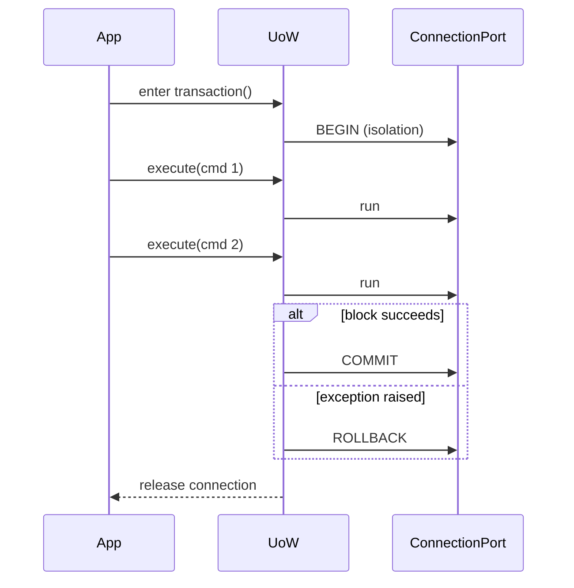
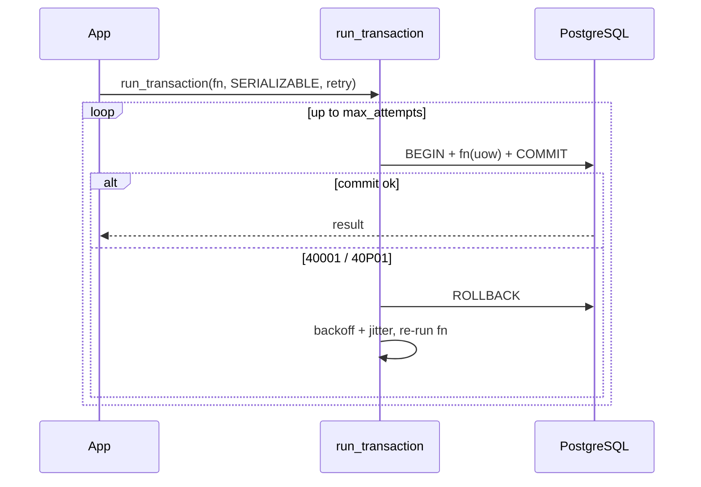

# 07 — Data Access & Transactions

Layer L2 is where queries actually run. Its design goals: **correctness**
(transactions, parameterization), **performance** (streaming, batching), and
**decoupling** (no psycopg types leak upward).

## 7.1 The execution pipeline (Template Method + Decorator)

Every query flows through a fixed skeleton; cross-cutting steps are decorators
added/ordered by config.


- The **skeleton** (`validate → acquire → execute → map → release`) never changes.
- Decorators (tracing, metrics, breaker, retry, audit) are **opt-in** and **ordered** via config — you pay only for what you enable (Requirement 4).
- `release` runs in a `finally`/context-manager so connections never leak on error.

## 7.2 Safe parameterization (no SQL injection, no string building)

```python
# QuerySpec carries SQL text + bound params separately — ALWAYS parameterized.
spec = QuerySpec(
    sql="SELECT id, total FROM orders WHERE customer_id = %(cid)s AND status = %(st)s",
    params={"cid": customer_id, "st": "paid"},
)
```

- User values are **always** bound parameters, never concatenated (Builder pattern enforces this).
- Identifiers that must be dynamic (rare) go through `psycopg.sql.Identifier` — never f-strings.
- A lint/review rule forbids `f"...{...}..."` inside `QuerySpec.sql`.

## 7.3 Result mapping (Strategy)

`ResultMapper` converts raw rows into the shape the caller wants, chosen per call:

| Target | Use |
|--------|-----|
| `dict` rows (default) | General use, ergonomic |
| `tuple` rows | Lowest overhead, hot paths |
| dataclass / `TypedDict` | Typed access without an ORM |
| user-supplied `row_factory` | Full control |

Mapping is a **Strategy** so it's swappable and so the hot path can skip
dict-building overhead when tuples suffice.

## 7.4 Query vs Command (CQRS-lite)

```python
class Query(QuerySpec):   """Read — routable to replicas, retry-safe."""
class Command(QuerySpec): """Write — goes to primary, retried only if idempotent."""
```

This separation (a) enables read/write routing ([06 §6.6](./06-connection-management.md)) and
(b) makes retry-safety explicit — we never blindly retry a non-idempotent write.

## 7.5 Unit of Work (transaction boundary)

The **Unit of Work** owns a transaction: everything inside commits atomically or
rolls back together.

```python
async with foundation.transaction("orders-primary", isolation="READ COMMITTED") as uow:
    await uow.execute(Command("UPDATE accounts SET balance = balance - %(a)s WHERE id=%(id)s",
                             {"a": amount, "id": src}))
    await uow.execute(Command("UPDATE accounts SET balance = balance + %(a)s WHERE id=%(id)s",
                             {"a": amount, "id": dst}))
    # commit on clean exit; rollback on any exception
```



**Guarantees**

- One connection is pinned for the whole UoW (transactions are connection-bound).
- Nested `transaction()` calls use **savepoints** (`SAVEPOINT`/`RELEASE`/`ROLLBACK TO`).
- Isolation level is per-UoW and config-defaultable.
- Retry decorators are **disabled inside** an open UoW (you retry the whole UoW, not a mid-transaction statement).

## 7.6 Repository pattern (optional consumer ergonomics)

For teams that want a collection-like abstraction rather than raw SQL calls:

```python
class Repository(Generic[T]):
    def __init__(self, handle: DataSourceHandle, mapper: ResultMapper[T]): ...
    async def find(self, spec: Query) -> list[T]: ...
    async def one(self, spec: Query) -> T | None: ...
    async def execute(self, cmd: Command) -> int: ...   # rows affected
    async def stream(self, spec: Query) -> AsyncIterator[T]: ...
```

Repositories are **thin** — no hidden identity map or lazy loading (that would
make us an ORM, a non-goal). They exist to decouple consumer code from the
execution API and to centralize a team's SQL.

## 7.7 Streaming large result sets (performance)

For results too large to materialize, use server-side cursors:

```python
async for row in handle.stream(Query("SELECT * FROM big_table WHERE ...", {...})):
    process(row)      # constant memory; rows fetched in batches
```

- Backed by named server-side cursors with a configurable `itersize`.
- Never loads the full result set into memory.

> **This is the entry point for a larger capability.** Continuous/large-scan
> streaming, **interval/windowed fetching** (15-min buckets, time ranges), and
> **resumable incremental (watermark/keyset) fetching** are designed in full in
> [16 — Streaming & Interval Data Fetching](./16-streaming-and-interval-fetching.md),
> along with streaming ingest (`COPY`/`LISTEN`) and backpressure rules.

## 7.8 Bulk paths (performance)

| Operation | Mechanism | When |
|-----------|-----------|------|
| Bulk insert | psycopg `COPY` (`copy_from`) | Loading many rows — an order of magnitude faster than INSERT. |
| Batched writes | `executemany` with pipeline mode | Many parameterized commands. |
| Multi-statement round-trip reduction | psycopg **pipeline mode** | Latency-bound sequences. |

These are exposed as explicit facade methods (`handle.copy(...)`,
`handle.execute_many(...)`) so callers opt into the fast path deliberately.

## 7.9 Error mapping

The adapter translates psycopg's `SQLSTATE`-coded errors into the Core hierarchy
so consumers never catch psycopg types:

| SQLSTATE class | Core error | Retry-eligible? |
|----------------|-----------|-----------------|
| `08xxx` connection | `ConnectionError` / `TransientError` | yes (reads) |
| `40001` serialization failure | `TransientError` | yes |
| `40P01` deadlock | `TransientError` | yes |
| `23xxx` integrity | `IntegrityError` | no |
| `42xxx` syntax/undefined | `QueryError` | no |
| `57014` statement timeout | `TransientError`/`QueryError` | policy-based |

This keeps consumer error handling **driver-agnostic** — part of the decoupling
guarantee.

## 7.10 Concurrency & write-conflict handling

PostgreSQL is **MVCC** (multi-version concurrency control), which decides what the
foundation must — and must not — worry about.

### 7.10.1 What MVCC gives us for free

- **Readers never block writers; writers never block readers.** Every read sees a
  consistent snapshot. So pure reads — large batch extracts, streaming, interval
  queries, dashboards — **never** hit a write conflict.
- The **only** conflict class is **write–write on the same row** (or the same
  unique key). Everything below is about that case.

### 7.10.2 Isolation levels (a per-transaction policy)

The Unit of Work ([§7.5](#75-unit-of-work-transaction-boundary)) takes an explicit
isolation level; the default is **READ COMMITTED**.

| Level | Concurrent same-row write | When to use |
|-------|---------------------------|-------------|
| **READ COMMITTED** (default) | Second writer blocks, then proceeds against the new row version | Almost everything; fewest serialization failures |
| **REPEATABLE READ** | Second writer gets **`40001` serialization failure** → must retry | Multi-statement reads that must be self-consistent |
| **SERIALIZABLE** | `40001` if the schedule isn't serializable | Cross-row invariants (e.g. "sum must stay ≥ 0") |

Higher isolation trades more `40001` retries for stronger guarantees. Choose it
per transaction, from config-driven defaults — never hard-coded.

### 7.10.3 Conflicts are surfaced as typed, retry-classified errors

Reusing the mapping in [§7.9](#79-error-mapping):

- **`40001` serialization failure** and **`40P01` deadlock** → `TransientError` (**retry the whole transaction**).
- **`23505` unique violation** (e.g. two concurrent inserts of the same key) → `IntegrityError` (**not** retried — retrying won't help; handle or upsert).

### 7.10.4 Transaction-level retry (the key mechanism)

Statement-level retry is **disabled inside an open Unit of Work** ([10 §10.3](./10-observability-security-resilience.md)) — a serialization failure invalidates the *whole* transaction, so you must re-run the entire block. The foundation therefore offers a **retryable transaction runner** that takes the transaction body as a callable and re-executes it on `40001`/`40P01`:

```python
# Auto-retries the WHOLE body on serialization failure / deadlock.
await handle.run_transaction(
    lambda uow: transfer(uow, src, dst),
    isolation="SERIALIZABLE",
    retry=RetryPolicy(max_attempts=3, base_backoff_ms=20, jitter=True),
)
```

The plain `async with handle.transaction() as uow:` form stays available for
transactions that don't need auto-retry; `run_transaction(fn, …)` is the form to
use whenever `40001`/`40P01` is possible. (Public API: [11 §11.5](./11-public-api-reference.md).)



> **Idempotency caveat:** `fn` may run more than once, so it must not perform
> external side effects (emails, non-DB calls) that can't be repeated. Keep the
> body pure DB work; do side effects after the transaction commits.

### 7.10.5 Preventing lost updates (choose per write pattern)

| Strategy | Mechanism | Best for |
|----------|-----------|----------|
| **Atomic write** | `UPDATE t SET x = x + %(n)s WHERE id=%(id)s` — no read-modify-write in app | Counters, running totals |
| **Upsert** | `INSERT … ON CONFLICT (key) DO UPDATE …` (idempotent) | Aggregation tables, ingest, watermark rows |
| **Pessimistic lock** | `SELECT … FOR UPDATE` (optionally `SKIP LOCKED`) | Queue/claim patterns; serialize a hot row deliberately |
| **Optimistic concurrency** | a `version`/`updated_at` column: `UPDATE … WHERE id=%(id)s AND version=%(v)s`; 0 rows affected ⇒ conflict ⇒ retry | Read-modify-write where conflicts are rare |

The foundation supports all four via the basic write APIs; **optimistic
concurrency** is a documented convention (a `version` column + affected-rows check
that raises a retryable conflict), not hidden magic.

### 7.10.6 Coordinating jobs with advisory locks

For "only one run at a time" (e.g. the 15-min/1-h aggregation refresh, [08 §8.6a](./08-service-shell.md)),
use a **PostgreSQL advisory lock** so overlapping schedules can't double-write:

```python
# non-blocking: skip this run if another holds the lock
got = await handle.scalar(Query("SELECT pg_try_advisory_lock(%(k)s)", {"k": job_key}))
if got:
    try: ...        # do the refresh
    finally: await handle.execute(Command("SELECT pg_advisory_unlock(%(k)s)", {"k": job_key}))
```

Combined with idempotent upserts and the resumable watermark fetch
([16 §16.5](./16-streaming-and-interval-fetching.md)), scheduled writes are safe
even if two runners fire at once.

### 7.10.7 Guidance by workload (the Insite cases)

| Workload | Risk | Recommendation |
|----------|------|----------------|
| Batch **read** / streaming / interval / charts | none (MVCC snapshot) | nothing needed |
| **Aggregation refresh** (15m/1h) | overlapping runs; concurrent upserts | advisory lock + `ON CONFLICT` upsert |
| Streaming **ingest** of interval readings | duplicate/concurrent inserts | `ON CONFLICT DO NOTHING/UPDATE` on the natural key |
| Multi-writer **read-modify-write** | lost update | atomic `UPDATE`, or optimistic `version`, or `SELECT … FOR UPDATE` |
| Cross-row **invariant** | anomaly | SERIALIZABLE + `run_transaction` retry |

### 7.10.8 Design stance

The foundation provides the **mechanisms** (isolation control, typed conflict
errors, transaction-level retry, upsert/lock/optimistic support); the consumer
picks the **policy** per write pattern. Defaults (READ COMMITTED, a 3-attempt
transaction retry) are config-driven, never hard-coded. Recorded in
[ADR-010](./adr/ADR-010-concurrency-and-write-conflicts.md).

## 7.11 Why this satisfies the requirements

- **Req 4:** streaming, COPY, pipelining, tuple mapping, prepared statements, opt-in decorators.
- **Req 5:** Template Method, Decorator, Strategy, Unit of Work, Repository, Command/Query.
- **Req 7:** psycopg lives only behind the adapter; the Core error hierarchy and value objects are all consumers ever see.
