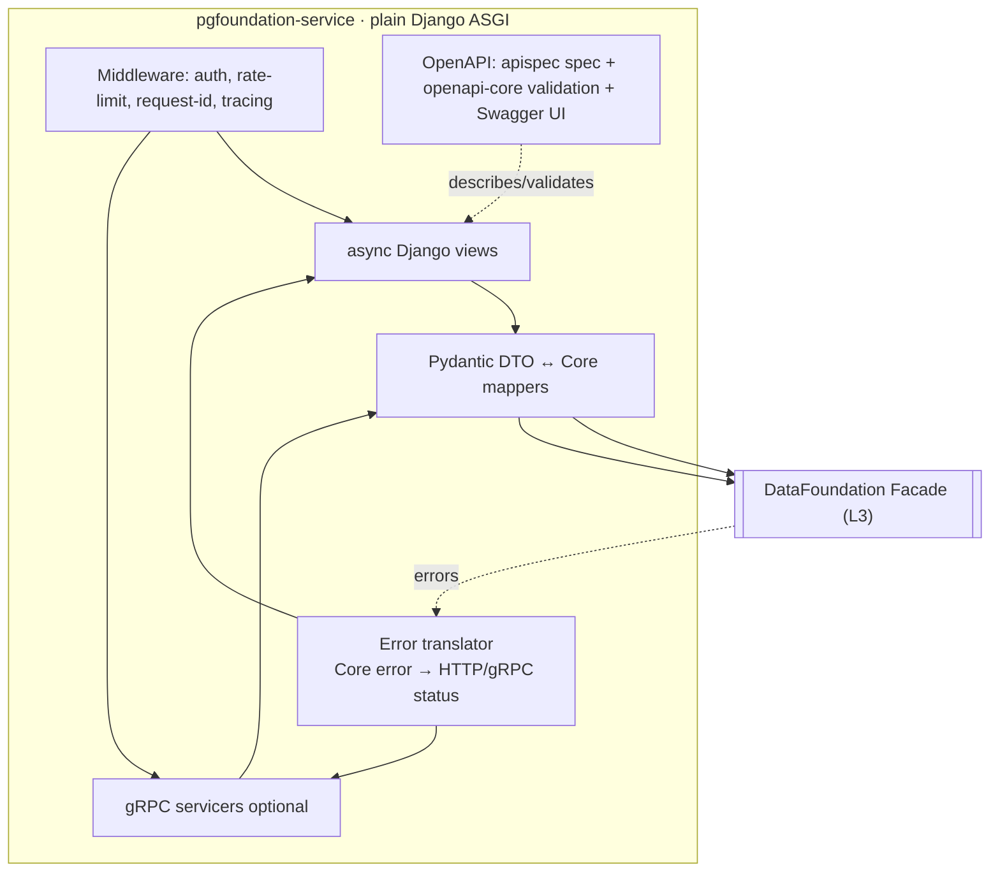
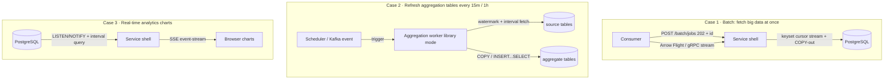
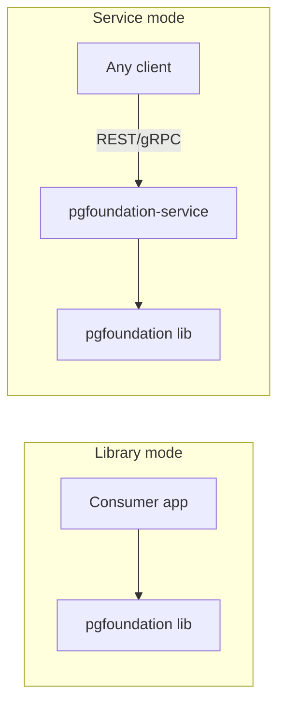

# 08 — Service Shell (Network Delivery Layer)

The service shell (L4) exposes the L3 Facade over the network so **non-Python**
consumers can use the foundation. It is **optional** — pure-library deployments
omit it entirely.

> **Cardinal rule:** the shell contains **no** data-access logic. It is a thin
> transport + auth skin over the *same* `DataFoundation` facade the library
> exposes. Behavioral parity between "library mode" and "service mode" is a
> guarantee, not a coincidence.

## 8.1 Framework choice

**Plain Django (ASGI, async views)** for REST + **grpcio** for optional gRPC,
chosen because the team is fluent in Django. Since plain Django has **no built-in
OpenAPI generator**, the shell adds a small, framework-agnostic OpenAPI toolchain.
Rationale and trade-offs in [ADR-012](./adr/ADR-012-service-shell-plain-django.md)
(supersedes the earlier FastAPI choice, [ADR-002](./adr/ADR-002-service-framework.md)).

| Concern | Choice |
|---------|--------|
| Web framework | **plain Django** on ASGI; `async def` views that `await` the async Facade |
| Schemas | **Pydantic v2** DTOs (reused from the foundation) |
| OpenAPI document | **`apispec`** — generated **code-first** from the Pydantic schemas → `/openapi.json` |
| Contract enforcement | **`openapi-core`** (`openapi_core.contrib.django`) — validate requests/responses vs the spec |
| Interactive docs | **Swagger UI / ReDoc**, vendored static assets, at `/docs` |
| gRPC (optional) | **`grpcio`** server alongside — independent of the web framework |

> **Django here means the *web layer only*.** The **core library stays
> framework-free** and **uses no ORM** ([ADR-012](./adr/ADR-012-service-shell-plain-django.md));
> Django's ORM/migrations are not used for foundation data access. Django **admin**
> may optionally be kept for ops.

## 8.2 Shell architecture



## 8.3 REST surface (illustrative)

| Method & path | Purpose |
|---------------|---------|
| `POST /v1/datasources/{name}/query` | Run a read query; body = SQL + params + options. |
| `POST /v1/datasources/{name}/execute` | Run a write command; returns rows-affected. |
| `POST /v1/datasources/{name}/transaction` | Run an ordered batch atomically (UoW). |
| `POST /v1/datasources/{name}/copy` | Bulk load (streaming). |
| `POST /v1/datasources/{name}/stream` | Stream a large read; response is chunked NDJSON, SSE, or Arrow IPC (content-negotiated). |
| `POST /v1/datasources/{name}/interval` | Time-bucketed / windowed fetch (`IntervalQuery`) — 15-min/hourly/daily buckets over a range. |
| `POST /v1/datasources/{name}/fetch-since` | Resumable incremental fetch; body carries the watermark, response returns rows + `next_watermark`. |
| `GET  /v1/datasources/{name}/subscribe/{channel}` | `LISTEN/NOTIFY` change stream via Server-Sent Events. |
| `POST /v1/batch/jobs` | Submit a long-running batch job (bulk extract/refresh); returns `202` + `job_id`. |
| `GET  /v1/batch/jobs/{id}` | Poll batch job status/result location (or receive a webhook on completion). |
| `GET  /v1/datasources` | List configured data-source names + roles. |
| `GET  /v1/health` / `GET /v1/ready` | Liveness / readiness (pool health). |
| `GET  /metrics` | Prometheus scrape endpoint. |

**Design constraints on the surface**

- Only **named** data sources are addressable — the client never sends a DSN.
- Requests carry SQL + **separate params** (parameterization enforced server-side).
- Optional server-side **allow-list / policy** can restrict which statements or schemas a given API credential may touch (defense in depth; config-driven).

### Example request/response

```jsonc
// POST /v1/datasources/orders-replica/query
{
  "sql": "SELECT id, total FROM orders WHERE customer_id = %(cid)s LIMIT %(lim)s",
  "params": { "cid": 42, "lim": 100 },
  "row_format": "dict",          // dict | tuple
  "timeout_ms": 3000
}
```
```jsonc
// 200 OK
{
  "rows": [ { "id": 1001, "total": "19.90" } ],
  "row_count": 1,
  "elapsed_ms": 4.2,
  "request_id": "01J...ULID"
}
```

### 8.3.1 OpenAPI on plain Django (code-first)

Plain Django has no built-in OpenAPI generator, so the shell produces the spec
from its **Pydantic DTOs** and serves docs — no DRF/Ninja:

```python
# DTOs are the source of truth (reused from the foundation)
class QueryIn(BaseModel):  sql: str; params: dict; timeout_ms: int | None = None
class QueryOut(BaseModel): rows: list[dict]; row_count: int; elapsed_ms: float

# apispec builds the OpenAPI 3 document code-first from the schemas
spec.components.schema("QueryIn",  QueryIn.model_json_schema())
spec.components.schema("QueryOut", QueryOut.model_json_schema())
spec.path("/v1/datasources/{name}/query", operations={...})   # ~40-line helper auto-registers these

# urls.py — plain Django
path("openapi.json", lambda r: JsonResponse(spec.to_dict()))   # the machine-readable spec
path("docs/",        swagger_ui_view)                          # vendored Swagger UI → /openapi.json

# async view: validate in (Pydantic) → call the framework-free Facade → validate out
async def query_view(request, name):
    body = QueryIn.model_validate_json(request.body)
    rs = await foundation.datasource(name).query(Query(body.sql, body.params))
    return JsonResponse(QueryOut(rows=rs.rows, row_count=rs.row_count, elapsed_ms=rs.elapsed_ms).model_dump())
```

- **`apispec`** assembles the spec from the Pydantic schemas — it stays in sync with the DTOs by construction.
- **`openapi-core`** validates real requests/responses against `/openapi.json` in the [contract tests (13)](./13-testing-strategy.md), so the spec can't drift; optionally as dev middleware too.
- **Swagger UI / ReDoc** static assets are vendored (no CDN) and point at `/openapi.json`, giving interactive docs + client-SDK generation.

## 8.4 gRPC surface

A `DataFoundation` service with `Query`, `Execute`, `Transaction` (client- or
server-streaming for large results), `Stream`/`Interval`/`Subscribe`
(server-streaming for continuous & windowed reads), and `Health` RPCs. Used for
high-throughput, low-latency internal callers where HTTP/JSON overhead matters.
Protobuf schemas live in `proto/` and generate typed stubs.

### Streaming delivery mechanics

The shell adapts one internal async stream ([16 — Streaming & Interval Fetching](./16-streaming-and-interval-fetching.md))
to whatever the client can consume — **without buffering the whole result**:

| Transport | Format | Django mechanism | Best for |
|-----------|--------|------------------|----------|
| Chunked HTTP | NDJSON (`Transfer-Encoding: chunked`) | async `StreamingHttpResponse` | Simple large exports |
| **Server-Sent Events** | `text/event-stream` | async `StreamingHttpResponse` (ASGI) | Live dashboards, `LISTEN/NOTIFY` feeds |
| **gRPC server-streaming** | protobuf messages | `grpcio` server (separate from Django) | Internal high-throughput consumers |
| **Arrow IPC** | `application/vnd.apache.arrow.stream` | async `StreamingHttpResponse` | Analytics / columnar consumers |

Django's **async `StreamingHttpResponse`** (on ASGI) streams an async generator
straight from the Facade. Network **backpressure** is honored end-to-end: a slow
client throttles the DB fetch rather than growing an unbounded server buffer.

## 8.5 Cross-cutting middleware

| Middleware | Responsibility |
|------------|----------------|
| **AuthN / AuthZ** | **Pluggable seam, disabled by default** — see [§8.5.1](#851-authentication--authorization-pluggable-seam-disabled-by-default). The foundation does **not** implement auth; a separate project provides it later. |
| **Rate limiting** | Per-credential token bucket; protects the database tier. (Uses the authenticated principal when auth is enabled; otherwise per-IP.) |
| **Request ID / correlation** | ULID per request; threaded into logs, traces, DB `application_name`. |
| **Tracing** | Start an OpenTelemetry span; propagate context to the DB span. |
| **Error translation** | Core error hierarchy → HTTP/gRPC status codes (see below). |

### 8.5.1 Authentication & Authorization (pluggable seam, disabled by default)

Authentication and authorization are **required as a seam** for future use, but the
foundation **does not implement them** — they will be integrated by a **separate
project** ([ADR-013](./adr/ADR-013-auth-pluggable-seam.md)). The shell defines two
ports and wires **no-op defaults** so the service runs open out of the box:

```python
class AuthenticatorPort(Protocol):
    async def authenticate(self, request) -> Principal | None: ...   # who is calling?

class AuthorizerPort(Protocol):
    async def authorize(self, principal, action, resource) -> bool: ...  # may they?

# Default wiring when auth.enabled = false (the default):
class AllowAllAuthenticator: ...   # returns an anonymous Principal
class AllowAllAuthorizer:    ...   # returns True for everything
```

**Behavior by config**

| `auth.enabled` | Authenticator / Authorizer bound | Effect |
|----------------|----------------------------------|--------|
| `false` (**default**) | `AllowAll*` no-ops | Requests pass through; **no auth enforced** |
| `true` | the adapters registered by the **separate auth project** | AuthN → `401` on failure; AuthZ → `403` on deny |
| `true` **but no provider registered** | — | **Fail closed**: the shell refuses to start (never silently open) |

- The auth middleware runs first; it calls `authenticate` then `authorize` before the request reaches a view. With the no-ops, both are instant pass-throughs.
- The separate project plugs in by registering adapters for the two ports (API key / JWT / mTLS for AuthN; RBAC/ABAC + per-data-source/operation policy for AuthZ) — **no foundation change** required.
- **Security caveat:** disabled-by-default means the open service must run only on a trusted network / behind a gateway or mesh mTLS until the auth project is integrated. This is called out in [10 §10.2](./10-observability-security-resilience.md) and enforced by config profiles (prod profile should set `auth.enabled = true`).

## 8.6 Error translation

| Core error | HTTP | gRPC |
|------------|------|------|
| `QueryError` (bad SQL) | 400 | INVALID_ARGUMENT |
| `IntegrityError` | 409 | ALREADY_EXISTS / FAILED_PRECONDITION |
| `PoolTimeoutError` | 503 | UNAVAILABLE |
| `ConnectionError` (DB down) | 503 | UNAVAILABLE |
| circuit open | 503 + `Retry-After` | UNAVAILABLE |
| authN failure *(only when `auth.enabled`)* | 401 | UNAUTHENTICATED |
| authZ failure *(only when `auth.enabled`)* | 403 | PERMISSION_DENIED |
| unknown data source | 404 | NOT_FOUND |

Error bodies never leak SQL internals, credentials, or stack traces to clients
(they go to logs with the request ID).

## 8.6a Protocol selection by use case

The shell speaks several protocols over **one core**; pick per workload rather
than standardizing on one. Full rationale in
[ADR-007 — Consumer Protocol Strategy](./adr/ADR-007-consumer-protocol-strategy.md).

### Quick guide

| Consumer workload | Use this | Not this |
|-------------------|----------|----------|
| Normal request/response query, dashboard read | REST/JSON | — |
| Internal service, hot path, typed | gRPC (unary) | — |
| Live browser charts (one-way push) | **SSE** | polling REST |
| Internal live stream (backpressure) | **gRPC server-streaming** | — |
| Bulk extract / large one-shot fetch | **Arrow Flight** (+ async job) | one big JSON response |
| Long-running batch orchestration | **Async job API** (`/batch/jobs`) + poll/webhook | synchronous call |
| Scheduled incremental ETL | scheduled worker (library) / job trigger / Kafka event | client streaming |

### Worked examples (the three real cases)



**Case 1 — Batch, fetch big data at once → Arrow Flight + async job.**
Columnar bulk transport (Arrow Flight, or gRPC server-streaming) streams the
extract at flat memory straight into pandas/Spark/BI; a single synchronous JSON
response is rejected (timeouts, memory, no resume). For long extracts, submit via
`POST /v1/batch/jobs` (→ `202` + `job_id`), then poll/`GET` or receive a webhook;
the bytes flow over Arrow Flight. Paging is **keyset**, not `OFFSET`, so a
resumed pull has no gaps/dupes. Mechanics: [16 §16.3](./16-streaming-and-interval-fetching.md).

**Case 2 — Aggregation refresh every 15 min / 1 h → scheduled worker, no wire stream.**
This is write-side incremental ETL, so it needs **no streaming protocol**. Run a
**scheduled background worker** (library mode) that reads only new rows via
**watermark + interval** fetch and writes with `COPY` / `INSERT … SELECT` into the
aggregate tables. Trigger it with a scheduler (cron/Airflow/Celery), a lightweight
**REST/gRPC job call**, or a **Kafka/Redpanda event**. In the foundation these are
materialized-view / `INSERT … SELECT` refreshes. Guard against overlapping runs
with a **`pg_advisory_lock`** and make the writes idempotent with `ON CONFLICT`
upserts — see [07 §7.10 Concurrency & Write-Conflict Handling](./07-data-access-and-transactions.md).
Mechanics: [16 §16.4–16.5](./16-streaming-and-interval-fetching.md).

**Case 3 — Real-time analytics charts → SSE (browser) / gRPC streaming (internal).**
Live charts are one-way push. For **browsers**, **SSE** is the simplest correct
choice — native `EventSource`, auto-reconnect, plain HTTP — fed by `LISTEN/NOTIFY`
plus short interval queries. Use **gRPC server-streaming** instead only if the
consumer is an internal service (native backpressure, typed). Polling REST is
rejected. Mechanics: [16 §16.6–16.8](./16-streaming-and-interval-fetching.md).

## 8.7 Deployment shapes



- **Library mode:** no shell; lowest latency; Python consumers only.
- **Service mode:** horizontally scalable stateless pods behind a load balancer; connection pools live in the service, so it also acts as a **shared connection concentrator** (fewer total DB connections than every app pooling independently — a real scaling benefit for large fleets).
- Health/readiness wired to K8s probes; SIGTERM triggers graceful pool drain ([06 §6.7](./06-connection-management.md)).

## 8.8 The existing Django scaffold is *repurposed* as the shell

The repo already contains a Django `startproject` scaffold in
`postgresqlmodule/code` (`core/settings.py`, `manage.py`, ASGI/WSGI). Under
[ADR-012](./adr/ADR-012-service-shell-plain-django.md) this becomes the basis of
the **service shell** rather than being retired: keep the Django project, run it on
**ASGI with async views**, add the `apispec`/`openapi-core`/Swagger-UI toolchain
(§8.3.1), and point views at the framework-free Facade.

Two rules hold regardless:
- **The core `pgfoundation` library imports no Django** — enforced by import-linter ([12 §12.3](./12-project-structure-and-packaging.md)).
- **No Django ORM for foundation data access** — the foundation speaks plain, parameterized SQL ([ADR-012](./adr/ADR-012-service-shell-plain-django.md)). Django's ORM/migrations stay unused by the foundation, which owns no tables; Django **admin** may optionally be kept for ops dashboards.

(The default SQLite `DATABASES` in the scaffold's `settings.py` is irrelevant to
the foundation — the foundation manages its own PostgreSQL connections; you may
remove it or leave a minimal entry only if you use Django admin/sessions.)
