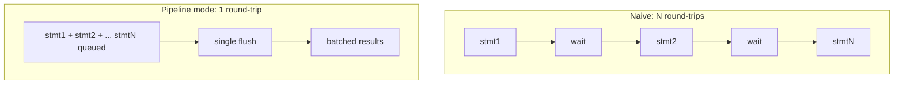

# 09 — Performance Engineering

Requirement 4 — *"must keep efficient and best performance"* — drives concrete,
measurable design choices. This document lists them and the reasoning.

## 9.1 Performance principles

1. **Async-first.** DB work is I/O-bound; async lets one process handle thousands of concurrent queries without thread-per-request overhead.
2. **Reuse everything expensive.** Connections and prepared statements are pooled/cached, never recreated per call.
3. **Pay only for enabled features.** Every decorator (tracing/metrics/retry) is optional and ordered by config; the hot path with everything off is nearly bare-metal psycopg.
4. **Move less data.** Stream large results; use binary protocol; select only needed columns.
5. **Fewer round-trips.** Pipeline mode, batching, and COPY collapse N round-trips into 1.

## 9.2 Driver & protocol choices

| Choice | Why |
|--------|-----|
| **psycopg 3** | Native async, connection pooling, pipeline mode, server-side cursors, COPY, binary protocol. See [ADR-001](./adr/ADR-001-driver-psycopg3.md). |
| **Binary result format** | Skips text↔type parsing overhead for common types. |
| **Prepared statements** | psycopg auto-prepares frequently-run statements → server skips re-planning. Configurable threshold. |
| **Server-side cursors** | Constant-memory streaming of large result sets. |

## 9.3 Connection pooling (the biggest lever)

- One tuned `AsyncConnectionPool` per data source (see [06](./06-connection-management.md)).
- **Warm** `min_size` connections to avoid connect latency on first hit.
- **Bounded** `max_size` + acquire timeout → backpressure instead of collapse.
- **Recycle** by `max_lifetime` to shed connections with bloated memory/plan caches.
- In **service mode**, the shell becomes a **connection concentrator**: a fleet of 200 app instances shares one bounded pool set instead of opening 200×N connections — dramatically reducing PostgreSQL backend load (each PG backend is a process with real memory cost).

## 9.4 Reducing round-trips

| Technique | Speedup source |
|-----------|----------------|
| **Pipeline mode** | Send many statements without waiting for each reply. |
| **`executemany` (batched)** | One protocol exchange for many parameter sets. |
| **`COPY`** | Bulk load bypasses the INSERT parse/plan/execute path per row. |

## 9.5 Memory & CPU efficiency

- Default to **tuple rows** on hot paths (dict-building has real cost at volume); dict/dataclass mapping is opt-in.
- Stream (`async for`) rather than materialize large sets.
- Reuse `QuerySpec` objects where possible so prepared-statement identity is stable.
- Avoid per-call object churn in the pipeline (pre-built decorator chains, not rebuilt per request).

## 9.6 Concurrency model

- Async event loop per worker; multiple workers per host (one loop can't use >1 core for CPU, but DB work is I/O-bound so a few workers saturate a host's network to PG).
- Per-data-source **bulkheads** isolate slow databases.
- Bounded queues everywhere — no unbounded buffering that turns latency into OOM.

## 9.7 Performance budgets & SLOs (targets to validate)

These are *design targets*, to be verified by the load tests in [13](./13-testing-strategy.md):

| Metric | Target (indicative) |
|--------|---------------------|
| Facade overhead above raw psycopg (features off) | < 5% p50, < 10% p99 |
| Pool acquire (warm, uncontended) | < 1 ms p99 |
| Simple point read, warm pool, same AZ | within ~1.2× of raw psycopg |
| COPY bulk load throughput | ≥ 80% of raw `COPY` |
| Service-mode REST overhead vs library mode | dominated by network + JSON; documented, not hidden |

## 9.8 Anti-bloat rules

- No ORM identity map / lazy loading (would add hidden queries + memory).
- No implicit N+1 helpers; batch APIs are explicit.
- No reflection/introspection on the hot path; schema metadata (if any) is cached at startup.
- Feature decorators compile to no-ops (**Null Object**) when disabled — zero branch cost beyond one attribute lookup.

## 9.9 Measuring & regression-guarding performance

- Micro-benchmarks (pytest-benchmark) for the pipeline overhead.
- Load tests (Locust/k6 against the service shell; asyncio driver script for the library).
- Continuous **p50/p95/p99** latency + pool-saturation dashboards (see [10](./10-observability-security-resilience.md)).
- A CI perf gate on the facade-overhead micro-benchmark to catch regressions.
