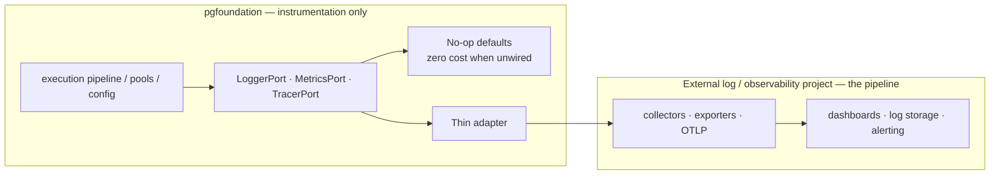
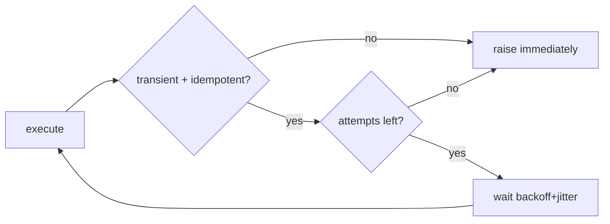
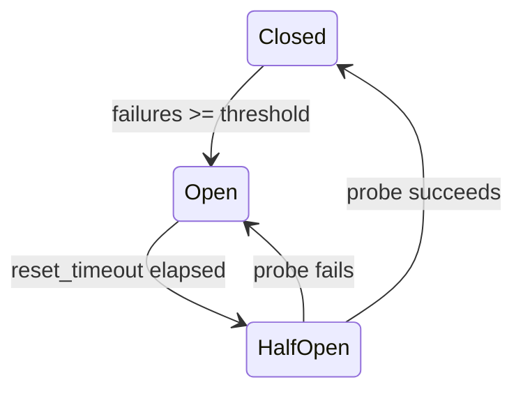

# 10 — Observability, Security & Resilience

The three cross-cutting concerns. They sit behind **Core ports** as
**decorators/adapters** (not baked into business logic), configured at the
composition root, and disable-able to zero cost. **Observability is *integrated*,
not built here**: the foundation instruments its code through ports and binds to
an **external log/observability project**; it does not implement the telemetry
pipeline ([ADR-014](./adr/ADR-014-observability-external-integration.md)).

---

## 10.1 Observability — integrate, don't reinvent

**The split:** the foundation owns **instrumentation** (what to emit); the
**external log/observability project** owns the **pipeline** (how it's collected,
exported, stored, and visualized). The foundation must **not** reimplement logging,
metrics, or tracing from scratch.

- The foundation **emits** through `LoggerPort` / `MetricsPort` / `TracerPort` and defines the **signal vocabulary** (metric/span names, log fields, correlation IDs) below.
- A **thin adapter** (e.g. OpenTelemetry, or one the log project ships) binds those ports to the external pipeline at the composition root — **config-driven, no foundation change** to swap backends.
- With nothing wired, **no-op defaults** make it zero-cost.

### The three pillars (what the foundation emits; the log project collects)

| Pillar | Foundation emits (port) | External project owns (pipeline) |
|--------|-------------------------|----------------------------------|
| **Logs** | Structured log events + correlation IDs via `LoggerPort` — query start/finish, pool events, config load, errors | aggregation, storage, search, retention |
| **Metrics** | Counters/gauges/histograms via `MetricsPort` (names below) | exporter (Prometheus/OTLP), scraping, dashboards |
| **Traces** | Spans + context propagation via `TracerPort` | collector, sampling backend, trace storage/UI |

### Key metrics (per data source) — the emitted vocabulary

These names/labels are the **stable contract** the external log project collects;
the foundation only emits them through `MetricsPort`.

| Metric | Type | Why |
|--------|------|-----|
| `pgf_query_duration_seconds` | histogram | Latency SLOs, slow-query detection |
| `pgf_pool_in_use` / `pgf_pool_size` | gauge | Saturation / capacity planning |
| `pgf_pool_acquire_wait_seconds` | histogram | Backpressure early warning |
| `pgf_pool_timeouts_total` | counter | Saturation incidents |
| `pgf_query_errors_total{sqlstate}` | counter | Error taxonomy |
| `pgf_retries_total` | counter | Transient-failure pressure |
| `pgf_circuit_state{datasource}` | gauge | Breaker open/closed |

### Correlation

A ULID request-id is generated at the edge (service shell) or accepted from the
caller, attached to logs/traces, **and** set as PostgreSQL `application_name` /
a `SET application_name` so DB-side logs (`pg_stat_activity`) correlate to app
requests. This closes the loop from client → app → database.

### Slow-query & audit log

- Queries over a configurable threshold are logged with sanitized SQL (params redacted) + `EXPLAIN`-on-demand hook.
- An **audit decorator** can record who ran what against which data source (for compliance), writing to a separate audit sink.

### Null-object default (zero cost when unwired)

If no external observability adapter is bound (the default), `NoopLogger` /
`NoopMetrics` / `NoopTracer` are injected — no `if enabled:` checks pollute the
pipeline, and overhead is a single attribute lookup. Wiring the external log
project's adapter is a composition-root/config change, not a code change
([ADR-014](./adr/ADR-014-observability-external-integration.md)).

---

## 10.2 Security

### Secret hygiene (ties to [05](./05-configuration.md))

- Credentials come from a **secret manager**, never code or committed files.
- Held as `SecretStr`; redacted in logs, reprs, error messages, and `/config` output.
- Rotation supported via re-resolution + graceful pool rebuild.

### Transport & connection security

- **TLS to PostgreSQL** enforced; production profile defaults to `sslmode=verify-full` with a configured root cert.
- **TLS on the service shell** (or mTLS for internal service-to-service).

### Authentication & authorization (pluggable seam — disabled by default)

The foundation **does not implement** API auth. It exposes a **pluggable seam**
(`AuthenticatorPort` / `AuthorizerPort`) with **no-op defaults**, so auth is
**disabled by default**; a **separate project** integrates real AuthN/AuthZ later
by registering adapters — no foundation change. Full design:
[08 §8.5.1](./08-service-shell.md), decision: [ADR-013](./adr/ADR-013-auth-pluggable-seam.md).

| Concern | Foundation's role (seam) | Provided later by the separate auth project |
|---------|--------------------------|---------------------------------------------|
| AuthN | Call `authenticate(request)`; default `AllowAll` (anonymous principal) | API key / JWT / mTLS strategy |
| AuthZ | Call `authorize(principal, action, resource)`; default `AllowAll` (true) | Credential → allowed data sources + operation classes (read/write/copy); RBAC/ABAC |
| Statement policy (optional) | Reserved hook | Allow-list of schemas/tables or deny-list of dangerous statements per credential |

> **Security caveat — default-open.** With `auth.enabled = false` the service enforces
> **no** authentication/authorization. Until the separate auth project is integrated,
> run the shell **only** on a trusted network / behind a gateway or mesh mTLS. When
> `auth.enabled = true` but no provider is registered, the shell **fails closed**
> (refuses to start) — it never runs silently open with auth "on". Production config
> profiles should set `auth.enabled = true`.

### Least privilege at the database

- Each data-source DSN should use a **role scoped** to only the rights that consumer needs (read-only replicas get read-only roles). Enforced by convention + documented in the runbook; the `read_only: true` flag also sets the session `default_transaction_read_only`.

### Injection defense

- Parameterization is **structural** (QuerySpec separates SQL from params); dynamic identifiers only via `psycopg.sql.Identifier`. Reviewed by a lint rule ([07 §7.2](./07-data-access-and-transactions.md)).

### Data protection

- No query **parameter values** in logs by default (they may contain PII); only sanitized SQL text.
- Configurable field-level redaction for known-sensitive columns in audit logs.

---

## 10.3 Resilience

Resilience behaviors are **decorators** around `ConnectionPort.execute`,
ordered and tuned by config.

### Retry (with backoff + jitter)

- Only **idempotent** operations (all reads; writes marked idempotent) are retried.
- Only **transient** errors (`08xxx`, `40001` serialization, `40P01` deadlock) are retried.
- Exponential backoff with full jitter; `max_attempts`, `base_backoff_ms`, `max_backoff_ms` from config.
- Retries are **disabled inside an open Unit of Work** (you retry the whole UoW).

> **Statement retry vs. transaction retry.** The decorator above retries a *single
> statement*. A `40001` serialization failure / `40P01` deadlock invalidates the
> *entire transaction*, so it is retried at a different level — the **retryable
> transaction runner** `run_transaction(fn, …)`, which re-executes the whole
> transaction body. See [07 §7.10 Concurrency & Write-Conflict Handling](./07-data-access-and-transactions.md) and [ADR-010](./adr/ADR-010-concurrency-and-write-conflicts.md).

### Circuit breaker

- Per data source. Opens after `failure_threshold` consecutive failures; fails fast (`ConnectionError`/503) during the open window; half-opens to probe recovery.
- Fed by the `HealthMonitor` (Observer) and by live execution failures.

### Timeouts (defense in depth)

| Level | Setting |
|-------|---------|
| Pool acquire | `acquire_timeout_seconds` |
| Statement | `statement_timeout_ms` (server-side) |
| Request (shell) | per-request deadline, propagated to statement timeout |

### Bulkheads

Independent pools per data source ([06](./06-connection-management.md)) prevent one
database's failure from consuming all resources.

### Graceful degradation & shutdown

- On DB down: fail fast via breaker; readiness probe flips so the load balancer stops sending traffic; liveness stays up so the pod isn't killed for a transient DB outage.
- On SIGTERM: stop accepting new work, drain in-flight up to a deadline, close pools cleanly.

---

## 10.4 Requirement traceability

| Requirement | Addressed by |
|-------------|--------------|
| 3 · No hard-coding | All thresholds/timeouts/toggles are config; secrets externalized. |
| 4 · Performance | Null-object no-ops; opt-in decorators; fail-fast breaker protects latency. |
| 5 · Design patterns | Decorator, Observer, Circuit Breaker, Strategy, Null Object, Bulkhead. |
| 7 · Decoupled layers | All three concerns sit behind Core ports; core logic is unaware of them. |
