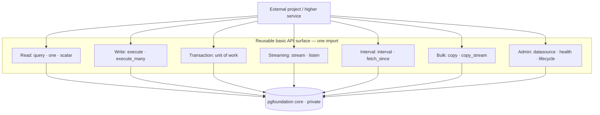

# 11 — Public API Reference (The Reusable Surface)

Requirement 6 — *"expose reusable APIs for external projects to consume"* — means
two things, and this document honors both:

1. **A *set* of reusable, composable *basic* APIs** — not a single monolithic
   call. External projects get useful building blocks (read, write, transaction,
   stream, interval, bulk/batch, admin/health) that they combine to build higher
   services.
2. **Only reusable APIs are exposed.** Everything else (drivers, pools, config,
   decorators) stays private. "Only" qualifies *what leaks*, not *how many
   operations* — there is **one public package**, exposing **many curated basic
   operations**.

> In short: **one import, many reusable APIs.** The `DataFoundation` object is the
> composition entry point; the *reusable API surface* is the catalog of basic
> operations in [§11.4a](#114a-catalog-of-reusable-basic-apis) that it and its
> handles expose. Signatures are illustrative, not final.

## 11.1 The public/private boundary

```
pgfoundation/                 ← the ONLY import path consumers use
  __init__.py                 ← re-exports the public surface (below)
  _internal/                  ← everything else; underscore = private, no stability promise
    config/  connection/  access/  drivers/  resilience/  observability/
```

- Public = what `pgfoundation/__init__.py` re-exports. Documented, semver-stable.
- Private = anything under `_internal/`. May change any release. Consumers must not import it (enforced by an import-linter public-API contract + documented policy).

## 11.2 Public surface (the whole list)

```python
from pgfoundation import (
    DataFoundation,        # the Facade — entry point
    DataSourceHandle,      # per-data-source ergonomic wrapper
    Query, Command,        # query/command value objects
    QuerySpec,             # base spec (SQL + params)
    IntervalQuery,         # time-bucketed / windowed fetch spec (N4)
    WatermarkCursor, Page, # resumable incremental fetch (N4)
    NotifyEvent,           # LISTEN/NOTIFY change event (N4)
    ResultSet, Row,        # results
    IsolationLevel,        # enum
    RetryPolicy,           # transaction-level retry (serialization/deadlock)
    Repository,            # optional base class
    # error hierarchy (catchable, driver-agnostic):
    PgFoundationError, ConfigError, ConnectionError, PoolTimeoutError,
    QueryError, IntegrityError, TransactionError, TransientError,
    HealthStatus,
)
```

That is the *entire* contract. psycopg, Django (the shell), Pydantic, config
providers — none of them appear here.

## 11.3 Bootstrapping (composition root, called once)

```python
from pgfoundation import DataFoundation

# From a config file + env + secret manager (the provider chain):
foundation = await DataFoundation.from_config("pgfoundation.yaml")

# ...or fully programmatic (tests / embedding), still no hard-coded literals in the lib:
foundation = await DataFoundation.from_settings(app_settings)

await foundation.start()      # warm pools
...
await foundation.aclose()     # graceful drain (or use as async context manager)
```

```python
async with await DataFoundation.from_config("pgfoundation.yaml") as foundation:
    ...
```

## 11.4 The Facade

```python
class DataFoundation:
    @classmethod
    async def from_config(cls, path_or_provider, /) -> "DataFoundation": ...
    @classmethod
    async def from_settings(cls, settings: AppSettings, /) -> "DataFoundation": ...

    def datasource(self, name: str) -> DataSourceHandle: ...   # O(1); raises if unknown
    def names(self) -> list[str]: ...

    # convenience passthroughs to a named data source:
    async def query(self, name: str, spec: Query) -> ResultSet: ...
    async def execute(self, name: str, cmd: Command) -> int: ...
    def transaction(self, name: str, *, isolation: IsolationLevel = ...) -> "UnitOfWork": ...

    async def health(self) -> dict[str, HealthStatus]: ...
    async def start(self) -> None: ...
    async def aclose(self) -> None: ...
    async def __aenter__(self) -> "DataFoundation": ...
    async def __aexit__(self, *exc) -> None: ...
```

## 11.4a Catalog of reusable basic APIs

This is the heart of Requirement 6: a **curated set of composable basic
operations** external projects reuse. They are grouped by category; each is a
stable, typed, driver-agnostic building block. Consumers pick the ones they need
and compose them — they do **not** get one god-method, and they do **not** get raw
psycopg.

| # | Category | Basic API | Purpose |
|---|----------|-----------|---------|
| 1 | **Read** | `query(spec)` | Run a parameterized read → `ResultSet`. |
| 2 | | `one(spec)` | First row or `None`. |
| 3 | | `scalar(spec)` | Single value (e.g. a `COUNT`). |
| 4 | **Write** | `execute(cmd)` | Run a write → rows affected. |
| 5 | | `execute_many(cmd, seq)` | Batched parameterized writes (pipeline). |
| 6 | **Transaction** | `transaction(...)` (Unit of Work) | Atomic multi-statement boundary + savepoints. |
| 6a | | `run_transaction(fn, ...)` | Retryable transaction — re-runs the whole body on serialization failure/deadlock (`40001`/`40P01`). |
| 7 | **Streaming** | `stream(spec)` | Constant-memory async iteration (server-side cursor). |
| 8 | | `listen(channel)` | `LISTEN/NOTIFY` change stream. |
| 9 | **Interval / windowed** | `interval(spec)` | Time-bucketed / windowed fetch (15-min, hourly…), generic PostgreSQL. |
| 10 | | `fetch_since(spec, cursor)` | Resumable incremental (watermark/keyset) fetch. |
| 11 | **Bulk / batch** | `copy(table, rows)` | High-throughput bulk load (`COPY`). |
| 12 | | `copy_stream(table, rows)` | Streaming bulk ingest, flat memory. |
| 13 | **Admin / ops** | `datasource(name)` / `names()` | Resolve / list the configured data sources. |
| 14 | | `health()` | Per-data-source & aggregate health. |
| 15 | | `start()` / `aclose()` | Lifecycle (warm pools / graceful drain). |
| 16 | **Composition helper** | `Repository[T]` (optional) | Collection-style wrapper built from the basics above. |



**Design intent:** these basics are deliberately **low-level and general** so any
external project — a REST service, an ETL worker, an ML feature job, or a future
semantic layer — composes them rather than reaching into the foundation.
Higher-level convenience APIs (e.g. `Repository`, or a future semantic layer's
metric APIs) are *built from* this same catalog, never around it. Adding a new
basic API is an additive, semver-minor change; none of the existing ones break.

Each basic API is available in **two equivalent forms**:
- **Facade form** — `foundation.query(name, spec)` (name-addressed, convenient).
- **Handle form** — `foundation.datasource(name).query(spec)` (bind once, reuse).

The service shell ([08](./08-service-shell.md)) exposes this **same catalog** over
REST/gRPC/SSE/Arrow, so the network API and the library API are one-to-one.

## 11.5 The per-data-source handle

```python
class DataSourceHandle:
    name: str

    async def query(self, spec: Query) -> ResultSet: ...
    async def one(self, spec: Query) -> Row | None: ...
    async def scalar(self, spec: Query) -> object | None: ...
    async def execute(self, cmd: Command) -> int: ...              # rows affected
    async def execute_many(self, cmd: Command, params_seq) -> int: ...
    def stream(self, spec: Query) -> AsyncIterator[Row]: ...       # server-side cursor
    async def copy(self, table: str, rows) -> int: ...             # bulk load
    def transaction(self, *, isolation: IsolationLevel = ...) -> "UnitOfWork": ...
    # retryable transaction: re-runs the whole body on 40001/40P01 (see doc 07 §7.10.4)
    async def run_transaction(self, fn, *, isolation: IsolationLevel = ...,
                              retry: RetryPolicy = ...) -> object: ...
    async def health(self) -> HealthStatus: ...

    # --- Streaming & interval fetching (N4) — see doc 16 ---
    def interval(self, spec: IntervalQuery) -> AsyncIterator[Row]: ...        # time-bucketed / windowed
    async def fetch_since(self, spec: Query, cursor: WatermarkCursor,
                          *, limit: int) -> Page: ...                          # resumable incremental
    def listen(self, channel: str) -> AsyncIterator[NotifyEvent]: ...         # LISTEN/NOTIFY stream
    async def copy_stream(self, table: str, rows: "AsyncIterable") -> int: ...# streaming ingest
```

## 11.6 Canonical usage examples

**Simple read against one of several databases**

```python
orders = foundation.datasource("orders-replica")
rs = await orders.query(Query(
    "SELECT id, total FROM orders WHERE customer_id = %(cid)s",
    {"cid": 42},
))
for row in rs:
    print(row["id"], row["total"])
```

**Atomic write via Unit of Work**

```python
async with foundation.transaction("orders-primary") as uow:
    await uow.execute(Command("INSERT INTO orders(customer_id, total) VALUES (%(c)s, %(t)s)",
                              {"c": 42, "t": "19.90"}))
    await uow.execute(Command("UPDATE customers SET order_count = order_count + 1 WHERE id=%(c)s",
                              {"c": 42}))
    # commits on clean exit, rolls back on exception
```

**Retryable transaction — auto-retry on serialization failure / deadlock**

```python
# The whole body re-runs on 40001/40P01; keep it pure DB work (no external side effects).
async def move(uow):
    await uow.execute(Command("UPDATE accounts SET bal = bal - %(a)s WHERE id=%(s)s", {"a": amt, "s": src}))
    await uow.execute(Command("UPDATE accounts SET bal = bal + %(a)s WHERE id=%(d)s", {"a": amt, "d": dst}))

await foundation.datasource("orders-primary").run_transaction(
    move, isolation="SERIALIZABLE", retry=RetryPolicy(max_attempts=3, base_backoff_ms=20, jitter=True))
```

**Streaming a large result (constant memory)**

```python
analytics = foundation.datasource("analytics")
async for row in analytics.stream(Query("SELECT * FROM events WHERE day = %(d)s", {"d": day})):
    handle(row)
```

**Interval / windowed fetch — 15-minute meter readings (N4)**

```python
meters = foundation.datasource("readings")
async for bucket in meters.interval(IntervalQuery(
        source="readings", time_column="ts",
        start=t0, end=t1, every="15 minutes",
        metrics=[Agg("kwh", "sum")], group_by=["meter_id"], tz="America/New_York")):
    publish(bucket)          # aggregated in-DB, streamed at flat memory
```

**Resumable incremental fetch — poll every N minutes (N4)**

```python
cursor = WatermarkCursor(order_by=("ts", "id"), after=last_seen)
page = await meters.fetch_since(
    Query("SELECT ts, id, kwh FROM readings WHERE meter=%(m)s", {"m": id}),
    cursor, limit=1000)
for row in page.rows: ingest(row)
save(page.next_watermark)    # durable checkpoint → resume with no gaps/dupes
```

**Cross-database orchestration (still one facade)**

```python
async with foundation.transaction("orders-primary") as write:
    await write.execute(Command("UPDATE ...", {...}))
audit = foundation.datasource("analytics")
await audit.execute(Command("INSERT INTO audit_log ...", {...}))
```

**Optional repository**

```python
class OrderRepo(Repository[Order]):
    async def by_customer(self, cid: int) -> list[Order]:
        return await self.find(Query("SELECT * FROM orders WHERE customer_id=%(c)s", {"c": cid}))

repo = OrderRepo(foundation.datasource("orders-replica"), mapper=dataclass_mapper(Order))
orders = await repo.by_customer(42)
```

## 11.7 Stability & versioning contract

- **SemVer.** Breaking changes to the public surface → major version bump.
- Everything under `_internal/` is exempt from the stability promise.
- Deprecations ship with a warning for one minor cycle before removal.
- The service-shell REST/gRPC contract is versioned independently (`/v1/...`, proto package versioning).
- See [12 — Packaging](./12-project-structure-and-packaging.md) for release mechanics.

## 11.8 Why this satisfies Requirement 6

- Consumers get a **curated set of reusable basic APIs** ([§11.4a](#114a-catalog-of-reusable-basic-apis)) — read, write, transaction, streaming, interval, bulk/batch, admin — not a single call. They compose the ones they need.
- The APIs are deliberately **low-level and general**, so *any* external project reuses them; higher-level helpers (Repository, a future semantic layer's metrics) are **built from** them.
- Only reusable APIs are exposed: all machinery (pools, drivers, decorators, config) is private and replaceable without breaking anyone.
- The **same catalog** underlies library and service modes (REST/gRPC/SSE/Arrow), guaranteeing one-to-one parity.
- The surface is **extensible by addition**: a new basic API is a semver-minor change; existing ones stay stable.
