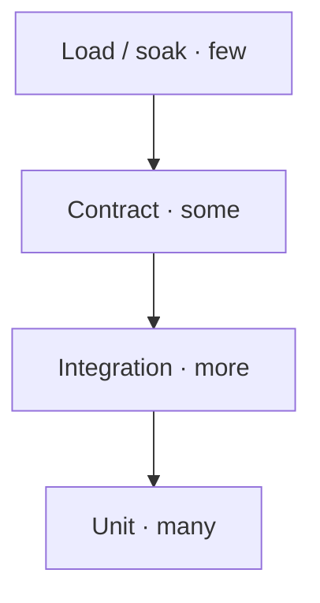

# 13 — Testing Strategy

The ports-and-adapters design makes the system highly testable: the core has no
I/O, so most logic is tested with fast in-memory fakes; real PostgreSQL is
exercised only where it matters.

## 13.1 Test pyramid

| Level | Scope | DB? | Speed |
|-------|-------|-----|-------|
| **Unit** | Pipeline, UoW, config chain, mappers, decorators — with fake `DriverPort`/`ConnectionPort` | no | ms |
| **Integration** | Real psycopg adapter + real PostgreSQL | yes (testcontainers) | seconds |
| **Contract** | REST/gRPC shell ↔ facade parity, OpenAPI/proto conformance | yes | seconds |
| **Load/soak** | Throughput, latency SLOs, pool behavior under saturation, leak detection | yes | minutes+ |

## 13.2 Unit testing (the majority)

Because every boundary is a port, we inject fakes:

- `FakeDriver` / `FakeConnection` — deterministic results, programmable failures (raise `TransientError` on attempt 1, succeed on 2 → test retry).
- `InMemoryConfigProvider` — exercise the provider chain & precedence without env/secret managers.
- `ManualClock` (`ClockPort`) — deterministic backoff/timeout tests (no wall-clock flakiness).
- `NoopMetrics` / recording `MetricsPort` spy — assert observability calls.

Targets: 100% of the execution pipeline branches, error mapping table, retry/breaker state machines, config precedence, UoW commit/rollback/savepoint logic.

## 13.3 Integration testing (real PostgreSQL)

- Spin up PostgreSQL via **testcontainers**; run the psycopg adapter against it.
- Verify: pooling (acquire/release/recycle), transactions & savepoints, isolation levels, streaming cursors, COPY, prepared statements, SQLSTATE → Core error mapping, statement timeouts, graceful shutdown/drain.
- Multi-database tests: register 2–3 data sources, assert bulkhead isolation (saturate one, others unaffected) and routing (writes→primary, reads→replica).

## 13.4 Contract testing (parity guarantee)

- The same logical operation is run through **library mode** and **service mode**; results must match — proves the shell adds no behavior.
- REST: validate responses against the OpenAPI schema; gRPC: against the proto contract.
- Error-translation matrix ([08 §8.6](./08-service-shell.md)) covered case-by-case.

## 13.5 Resilience / chaos testing

| Scenario | Expectation |
|----------|-------------|
| Kill DB mid-test | breaker opens, readiness flips, fast-fail; recovers on DB return |
| Inject transient errors | retry succeeds within `max_attempts`; non-idempotent writes not retried |
| Saturate pool | `PoolTimeoutError` (not hang); metrics record timeouts |
| Slow queries | statement timeout fires; connection returned to pool cleanly |
| SIGTERM under load | in-flight drains within deadline; no dropped commits |

Fault injection via a `ChaosDriver` decorator (fails/delays per policy) in unit
tests, plus toxiproxy in integration for network-level faults.

## 13.6 Performance testing (guards Requirement 4)

- **Micro-benchmarks** (pytest-benchmark): facade overhead vs raw psycopg with features off — CI gate on regression ([09 §9.7](./09-performance.md)).
- **Load tests**: k6/Locust against the service shell; an asyncio harness for library mode. Assert p50/p95/p99 SLOs and pool saturation behavior.
- **Soak test**: hours-long run watching for connection/memory leaks and prepared-statement cache growth.

## 13.7 Security testing

- Secret redaction: assert no credential appears in logs, reprs, error payloads, or `/config` output.
- Injection: property-based tests feeding hostile input as params — must never alter query structure.
- AuthN/Z: unauthorized credential → 403; unknown data source → 404; cross-tenant access denied.
- `pip-audit` / `bandit` / secret-scanning gates in CI.

## 13.8 CI gates (must pass to merge)

1. Ruff lint + format check.
2. mypy/pyright strict on the public surface.
3. **import-linter** architecture contracts ([12 §12.3](./12-project-structure-and-packaging.md)).
4. Unit + integration + contract suites green.
5. Perf micro-benchmark within regression budget.
6. Security scans clean.
7. Coverage threshold on core/access layers.
