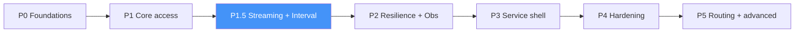

# 14 — Roadmap & Extensibility

## 14.1 Phased delivery plan

Each phase is independently shippable and testable. Earlier phases don't depend
on later ones.

> **Higher-level layers are deferred — not phases of the foundation.** A
> **Semantic & Serving Layer** and a **Time-Series** capability are **to be
> designed later**; they would depend on this foundation. The foundation only ships
> the generic **seams** they will need.

### Phase 0 — Foundations (walking skeleton)
- Core ports, value objects, error hierarchy.
- L0 config chain + Pydantic settings + composition root.
- psycopg `DriverPort` adapter; single-data-source pool.
- One end-to-end query through the facade. import-linter contracts wired.
- **Exit:** `foundation.query(...)` works against one DB, fully config-driven. The foundation owns no tables and performs no schema init ([12 §12.9](./12-project-structure-and-packaging.md)); consumers own all schema.

### Phase 1 — Core data access
- Connection Registry with **multiple** data sources (Requirement 1 fully met).
- Execution pipeline (Template Method), result mappers (Strategy).
- Unit of Work + savepoints; Query/Command split; streaming; COPY; execute_many.
- **Exit:** transactions, multi-DB, bulk & streaming paths all integration-tested.

### Phase 1.5 — Streaming & Interval Data Fetching (N4)
*Full design in [16](./16-streaming-and-interval-fetching.md).*
- Server-side **cursor streaming** with pinned connection + bounded-queue backpressure.
- **`IntervalQuery`** windowed/bucketed fetch (generic `date_bin`/`generate_series`); pluggable bucketing Strategy so a future time-series capability can later plug in TimescaleDB `time_bucket`.
- **Keyset + watermark** incremental fetch (`fetch_since`, resumable, no `OFFSET`).
- Streaming **ingest**: streaming `COPY`, `LISTEN/NOTIFY` change stream.
- **Dedicated streaming pool** (bulkhead) so long scans don't starve OLTP.
- **Exit:** a 15-min interval query and a resumable poll both stream at flat memory and integration-test green; OLTP latency unaffected under a concurrent long scan.
- **Seam-only (deferred):** logical-replication/CDC ingest; Arrow Flight. *(TimescaleDB continuous-aggregate acceleration belongs to a future time-series capability, not a foundation phase.)*

### Phase 2 — Resilience & observability
- Retry, circuit breaker, timeouts (decorators). Health monitor + events.
- Structured logs, Prometheus metrics, OTel tracing, correlation IDs.
- **Exit:** chaos tests pass; dashboards & SLOs in place.

### Phase 3 — Service shell
- **Plain Django (ASGI, async views)** REST surface + auth/rate-limit/correlation middleware ([ADR-012](./adr/ADR-012-service-shell-plain-django.md)).
- **OpenAPI** via `apispec` (code-first from Pydantic) + `openapi-core` validation + vendored Swagger UI.
- Optional gRPC servicers; error translation; OpenAPI/proto contracts.
- CLI (`health`, `config check`, `warmup`).
- **Exit:** contract tests prove library/service parity.

### Phase 4 — Hardening
- Secret-manager adapters (Vault/AWS/GCP), TLS `verify-full` profiles, least-privilege runbook.
- Perf tuning to hit SLO budgets; soak/leak testing; graceful shutdown.
- **Exit:** production readiness review passed.

### Semantic-layer support (foundation obligation, folded into P1–P3)
*A future Semantic & Serving Layer is **deferred (to be designed later)**; the foundation only ships the generic **seams** it will need, delivered across the phases above:*
- composable `QuerySpec` + safe parameterization (P1),
- result shaping incl. Arrow/stream (P1–P1.5),
- **materialized-view lifecycle** (`CREATE` / `REFRESH`) via the plain-SQL query/transaction API (P0/P1),
- **access-filter decorator hook** (P2).
- **Exit:** a future semantic layer could compile a metric → parameterized query, target a materialized view, and inject a tenant filter — all with **no foundation code change**.

### Phase 5 — Advanced (optional)
- Primary/replica read-write **routing** ([06 §6.6](./06-connection-management.md)).
- Hot config reload / secret rotation ([05 §5.7](./05-configuration.md)).
- Optional thin query-builder helper; optional caching decorator.

> **No time-series phase here.** Time-series is **deferred — to be designed later**
> as a higher-level capability on top of the foundation.

## 14.2 Extensibility seams already built in

The architecture pre-installs the seams so future work is *additive*, not
*invasive*:

| Future need | Seam that absorbs it | Core change required? |
|-------------|----------------------|-----------------------|
| New secret backend | New `ConfigProvider`/`SecretResolver` adapter | none |
| New observability backend | New `MetricsPort` adapter | none |
| Read/write routing | `RoutingStrategy` in L1 | none |
| Caching | New decorator in the pipeline | none |
| Another PostgreSQL-compatible driver | New `DriverPort` adapter | none |
| **New analytics requirement / metric / dimension** | A future semantic layer (deferred) | **none to the foundation** |
| **CDC / logical-replication ingest** | Reserved change-stream port + adapter | none to core |
| **New streaming delivery format (Arrow Flight, …)** | New delivery **Strategy** in the shell | none to core |
| **Semantic & Serving Layer (deferred)** | Would depend on the L3 Facade; uses composable `QuerySpec`, MV lifecycle & access-filter seams | none to core |
| **Hybrid / NL semantic search** | Part of the deferred semantic layer (vector adapter behind a port) | none to core |
| **Time-series capability (deferred)** | Would depend on the foundation; plugs a TimescaleDB **bucketing Strategy** | none to core |

## 14.3 Deferred higher-level work (to be designed later)

A **Semantic & Serving Layer** (metric registry, compiler, policy, aggregate
planning, serving) and a **Time-Series** capability (TimescaleDB: hypertables,
continuous aggregates, compression, retention) are **out of scope for the
foundation** and **will be designed later**. They would **depend on** this
foundation as a library.

The foundation only guarantees the **generic seams** they would build on: the
`DriverPort`, a **pluggable interval-bucketing Strategy** (foundation ships the
generic `date_bin`/`generate_series` implementation), composable `QuerySpec`,
materialized-view lifecycle, and an access-filter hook. **No semantic or
time-series code, tables, or dependencies are introduced in the foundation.**

## 14.4 Risks & mitigations

| Risk | Mitigation |
|------|-----------|
| Over-abstraction slows delivery | Walking skeleton first (P0); add patterns only where a real seam is needed. |
| Async complexity | Provide a documented sync facade wrapper over the async core for simple callers. |
| Service mode becomes a bottleneck | Stateless horizontal scaling + connection-concentrator benefit; load-tested SLOs. |
| psycopg lock-in | Isolated behind `DriverPort`; swappable. |
| Existing Django scaffold confusion | ADR-002 records the migration decision explicitly. |

## 14.5 Definition of done (v1)

- Requirements 1–7 each traceably satisfied (see per-doc traceability tables).
- Multi-DB, transactions, streaming, bulk paths integration-tested.
- Resilience + observability in place; SLOs met under load.
- Library + service modes at parity (contract tests).
- Zero hard-coded operational values; secrets externalized; architecture contracts green in CI.
- Requirement **N2** satisfied here: the foundation exposes the generic **seams** a future semantic layer needs. **N1/N3** (the semantic layer itself) are **deferred — to be designed later**.
- Requirement N4 (streaming & interval fetching) satisfied: cursor streaming, interval/windowed queries, resumable watermark fetch, streaming ingest — see [16 §16.14](./16-streaming-and-interval-fetching.md).
- Vector/NL-search + CDC seams present but unimplemented, by design.
- Semantic layer and time-series are **deferred — to be designed later** (§14.3).
