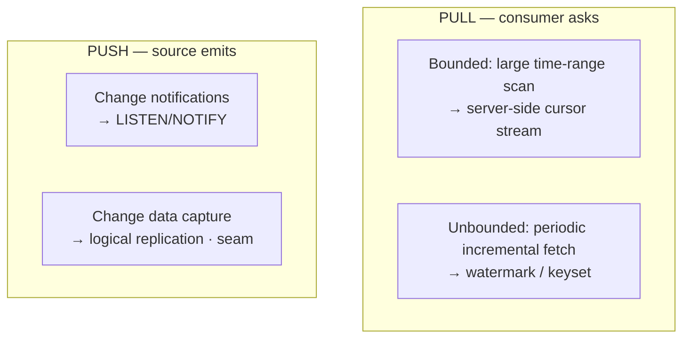
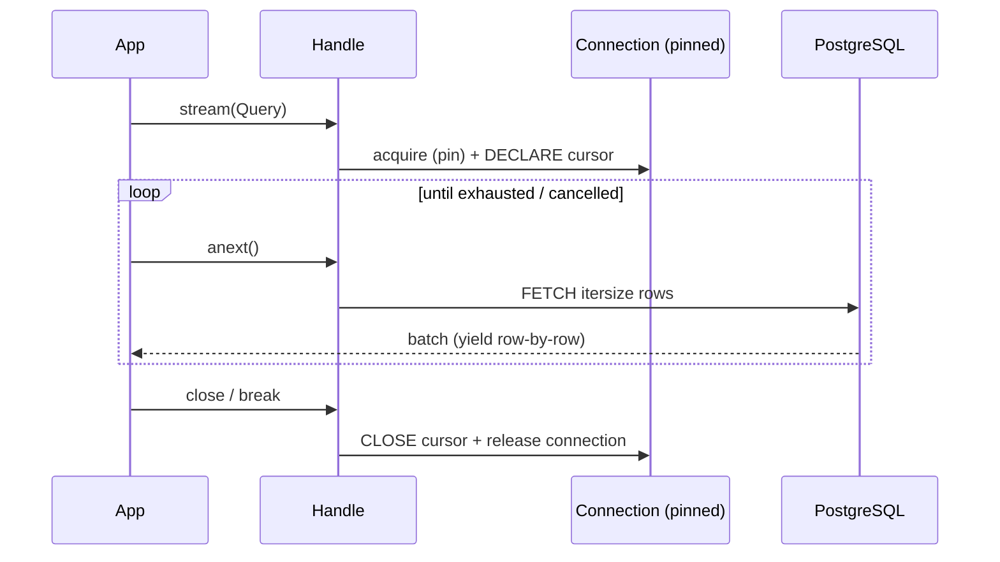
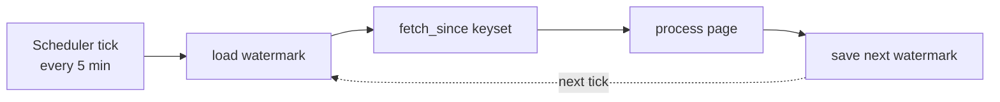

# 16 — Streaming & Interval Data Fetching

> **New requirement (2026-07).** The database server must **support streaming**
> and **interval data fetching**. In the Insite domain this is first-class:
> interval meter readings (15-minute), streaming sources (Kafka/Redpanda),
> streaming aggregation, real-time dashboards, and very large time-range scans.

This document designs both capabilities as **generic foundation mechanisms**
behind Core ports — no hard-coding, config-driven, backpressure-safe — while
keeping TimescaleDB-specific acceleration out (deferred to a future time-series capability), behind a pluggable seam.

---

## 16.1 What "streaming" and "interval fetching" mean here

| Term | Meaning in this design |
|------|------------------------|
| **Streaming (read-out)** | Constant-memory iteration over large or continuous result sets — never materialize the whole set. |
| **Streaming (ingest-in)** | High-throughput continuous writes (streaming `COPY`) and change notifications (`LISTEN/NOTIFY`, logical replication/CDC). |
| **Streaming (delivery)** | Push results to consumers as async iterators, chunked HTTP, Server-Sent Events, gRPC server-streaming, or Arrow IPC. |
| **Interval fetching (windowed)** | Time-bucketed / time-range queries — e.g. 15-min, hourly, daily buckets over `[start, end)`. |
| **Interval fetching (incremental)** | Resumable "give me everything since my last watermark" pulls, run periodically — keyset-based, no `OFFSET`. |

## 16.2 The problem space (two axes)



Each quadrant gets a dedicated, backpressure-safe mechanism below.

---

## 16.3 Streaming reads (server-side cursors)

Extends the streaming primitive introduced in
[07 §7.7](./07-data-access-and-transactions.md). A read is exposed as an **async
generator** backed by a **named server-side cursor**, fetched in batches of
`itersize`, with constant client memory.

```python
async for row in handle.stream(Query("SELECT ts, kwh FROM readings WHERE meter=%(m)s", {"m": id})):
    process(row)          # rows arrive in batches; memory stays flat
```

**Design rules**

- The cursor pins **one dedicated connection** for the stream's lifetime; it is returned to the pool only when the iterator closes (context-managed, `finally`-safe).
- `itersize` (batch size) is config-tunable per data source — throughput vs latency.
- **Cooperative cancellation:** breaking the loop / cancelling the task closes the cursor and releases the connection promptly.
- Long streams should target a **dedicated "streaming" data source/pool** (bulkhead) so they can't starve the OLTP pool — see §16.8.



---

## 16.4 Interval / windowed fetching

A declarative **`IntervalQuery`** value object expresses time-bucketed reads
without hand-written SQL:

```python
IntervalQuery(
    source="readings",              # governed table/view (whitelisted)
    time_column="ts",
    start=t0, end=t1,               # half-open [start, end)
    every="15 minutes",            # bucket width: 15m / 1h / 1d ...
    metrics=[Agg("kwh", "sum"), Agg("demand_kw", "avg")],
    group_by=["meter_id"],
    tz="America/New_York",         # bucket in local tz; store UTC
    gap_fill="null",               # null | previous | zero (aligned buckets)
)
```

The **Bucketing Strategy** is pluggable and compiles this to parameterized SQL:

- **Generic PostgreSQL (shipped in the foundation):** `date_trunc` / `date_bin` (PG14+) + `generate_series` for gap-filled, aligned buckets.
- **Pluggable acceleration seam:** a future time-series capability (deferred, to be designed later) could supply a TimescaleDB Strategy (`time_bucket` / `time_bucket_gapfill`, continuous aggregates) — selected transparently, no caller change. The foundation itself ships only the generic implementation.

**Guarantees:** half-open intervals (no double-counting at boundaries), UTC
storage with tz-correct bucketing, aligned bucket edges, optional gap-filling.
Values are always bound parameters; `source`/columns come from the whitelist
(injection-safe, [07 §7.2](./07-data-access-and-transactions.md)).

---

## 16.5 Incremental / watermark fetching (periodic pulls)

For jobs that poll "what's new since last time" on an interval (the common
meter-ingest / dashboard-refresh pattern), the foundation offers **keyset +
watermark** fetching — **never `OFFSET`** (which degrades linearly on large
tables).

```python
cursor = WatermarkCursor(order_by=("ts", "id"), after=last_seen)   # resumable
page = await handle.fetch_since(
    Query("SELECT ts, id, kwh FROM readings WHERE meter=%(m)s", {"m": id}),
    cursor, limit=1000,
)
for row in page.rows: ...
save(page.next_watermark)     # durable checkpoint → resume exactly here
```

- **Keyset pagination** on a stable, indexed `(ts, id)` tuple → constant-time pages regardless of depth.
- **Watermark** is a small, serializable checkpoint (timestamp + tiebreaker id). Persistence is the **caller's** concern — supplied by the caller, or written to a **consumer-owned** table via a configured data source. The foundation ships no watermark table of its own.
- **Idempotent & resumable:** a crashed/rescheduled job resumes from the last saved watermark with no gaps and no re-processing (half-open boundary).
- Pairs naturally with a scheduler (cron/Airflow/Celery) polling every N minutes — this is "interval data fetching" as periodic incremental pull.



---

## 16.6 Streaming ingest (write path)

| Mechanism | Use | Status |
|-----------|-----|--------|
| **Streaming `COPY` in** | Constant-memory bulk ingest of interval readings from an async row source | Core |
| **`LISTEN/NOTIFY`** | Subscribe to DB change channels as an async event stream (e.g. new-reading signals) | Core |
| **Logical replication / CDC** | Consume a change stream via the replication protocol | **Seam / optional (deferred)** |

```python
# streaming bulk ingest — memory stays flat regardless of volume
await handle.copy_stream("readings", async_row_source)

# change notifications
async for event in handle.listen("meter_events"):
    react(event.payload)
```

`LISTEN/NOTIFY` uses a dedicated pinned connection with automatic
re-subscription on reconnect (Observer). CDC/logical-replication is designed as a
**pluggable adapter behind a port** and left unimplemented in v1 to avoid scope
creep — the seam is reserved.

---

## 16.7 Streaming delivery (to consumers)

The same stream is served across delivery modes without changing the core:

| Mode | Library | Service shell |
|------|---------|---------------|
| Async iteration | `async for row in handle.stream(...)` | — |
| Chunked HTTP | — | `Transfer-Encoding: chunked` NDJSON |
| **Server-Sent Events** | — | `text/event-stream` for live dashboards |
| **gRPC server-streaming** | — | `stream` response RPC |
| **Arrow IPC stream** | Arrow batches | `application/vnd.apache.arrow.stream` |

The service shell ([08](./08-service-shell.md)) exposes streaming/interval
endpoints; it holds no logic beyond adapting the transport (parity preserved).

> **Which delivery protocol to pick** for a given consumer workload (bulk batch
> vs. scheduled aggregation vs. live charts) is decided in
> [08 §8.6a](./08-service-shell.md) and [ADR-007](./adr/ADR-007-consumer-protocol-strategy.md):
> Arrow Flight + async job for bulk extracts, a scheduled worker for aggregation
> refreshes, and SSE / gRPC-streaming for real-time charts.

---

## 16.8 Backpressure & resource safety (the hard part)

Streaming can exhaust memory and connections if done naively. Safeguards:

- **Bounded buffers** between producer (DB fetch) and consumer (Producer-Consumer with a fixed-size queue) — the DB is not read faster than the consumer drains.
- **Connection pinning + guaranteed release:** a stream owns its connection until close; context managers ensure release even on error/cancel.
- **Dedicated streaming pool (bulkhead):** configure a separate data source (or pool) for long streams so they can't starve short OLTP queries. Config-driven, no hard-coding.
- **Timeouts & idle caps:** max stream duration / idle timeout to reclaim leaked cursors.
- **Cooperative cancellation:** task cancellation propagates to `CLOSE cursor` + release.
- **Network backpressure:** chunked/SSE/gRPC writers respect consumer read speed; slow clients throttle the DB fetch rather than buffering unboundedly.

---

## 16.9 Design patterns introduced

| Pattern | Where | Why |
|---------|-------|-----|
| **Iterator / Generator** | `stream`, `interval` async iterators | Uniform pull interface, lazy evaluation |
| **Producer–Consumer (bounded queue)** | fetch ↔ consume decoupling | Backpressure, flat memory |
| **Cursor / Keyset pagination** | `fetch_since` | Constant-time deep pagination |
| **Memento / Checkpoint** | `WatermarkCursor` | Resumable, idempotent incremental fetch |
| **Strategy** | Pluggable interval bucketing, delivery format | Swap behavior by capability/config (a future time-series capability could supply TimescaleDB bucketing) |
| **Observer / Pub-Sub** | `LISTEN/NOTIFY`, reconnect | Push change streams |
| **Template Method** | The fetch-loop skeleton | Fixed loop, varying steps |
| **Adapter (deferred)** | Logical-replication/CDC, Arrow serialization | Isolate optional/heavy deps behind ports |

These compose with the foundation patterns in [04](./04-design-patterns.md).

---

## 16.10 Public API additions

```python
class DataSourceHandle:
    # (existing) large-result streaming
    def stream(self, spec: Query) -> AsyncIterator[Row]: ...

    # NEW — interval / windowed fetch
    def interval(self, spec: IntervalQuery) -> AsyncIterator[Row]: ...

    # NEW — resumable incremental fetch
    async def fetch_since(self, spec: Query, cursor: WatermarkCursor,
                          *, limit: int) -> Page: ...   # Page.rows, Page.next_watermark

    # NEW — change notifications
    def listen(self, channel: str) -> AsyncIterator[NotifyEvent]: ...

    # NEW — streaming ingest
    async def copy_stream(self, table: str, rows: AsyncIterable) -> int: ...
```

All additions are on the existing handle ([11](./11-public-api-reference.md)) and
follow the same value-object + parameterization discipline. `IntervalQuery`,
`WatermarkCursor`, `Page`, `NotifyEvent` join the public surface as Core value
objects.

---

## 16.11 A seam for a future semantic layer

Interval fetching is a **foundation seam** that a future (deferred) semantic layer
would build on: a metric like `total_kwh` at `grain: 15m` would compile to an
`IntervalQuery` executed through the foundation, and that layer's aggregate planner
could redirect it to a pre-materialized aggregate when one exists. The
streaming/interval mechanisms here are the *engine*; the governance and vocabulary
would live in that higher-level layer. The foundation exposes the seam; it holds no
metrics.

---

## 16.12 Performance notes

- Constant memory via cursors + bounded queues (§16.3, §16.8).
- **Keyset, never `OFFSET`** for deep/interval pagination (§16.5).
- Batched `FETCH` sized by `itersize`; binary/Arrow to cut serialization cost.
- Dedicated streaming pool isolates long scans from OLTP latency SLOs ([09](./09-performance.md)).
- Interval buckets pushed **down to the database** (aggregate in SQL, not in Python).

## 16.13 Scope & deferred seams

- **In scope now (design):** streaming reads, interval/windowed queries (generic PostgreSQL bucketing), watermark/keyset incremental fetch, streaming `COPY`, `LISTEN/NOTIFY`, streaming delivery adapters.
- **Deferred seams (designed, not built):** logical-replication/CDC ingest; Arrow Flight. Each sits behind a port so it's additive later.
- **Deferred (out of scope here):** TimescaleDB `time_bucket`/continuous-aggregate acceleration belongs to a future time-series capability (to be designed later); it would plug into the pluggable bucketing Strategy above.
- Consistent with the project stance: **no code is written now** — design only.

## 16.14 Requirement traceability

| Requirement | Addressed by |
|-------------|--------------|
| **N4 · Streaming support** | §16.3 (read), §16.6 (ingest), §16.7 (delivery), §16.8 (backpressure) |
| **N4 · Interval data fetching** | §16.4 (windowed/bucketed), §16.5 (incremental/watermark) |
| No hard-coding / patterns / clean code | §16.9 patterns; all tunables (itersize, pools, buckets) are config |
| Flexible development | Bucketing/CDC/delivery are Strategy/Adapter seams — additive, no core change |
