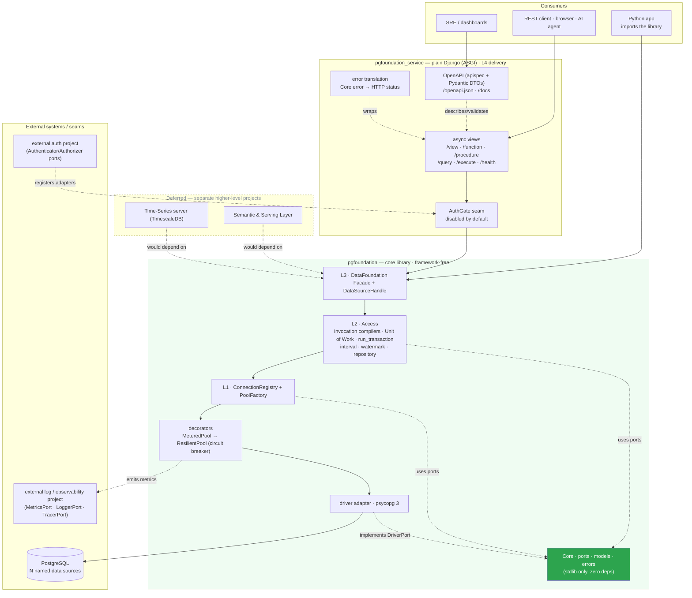
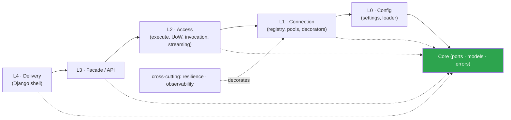
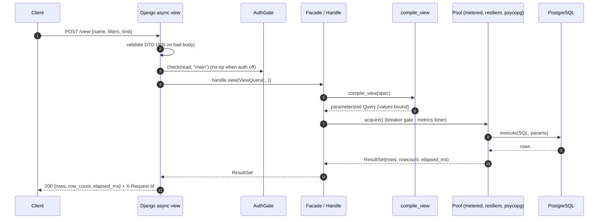
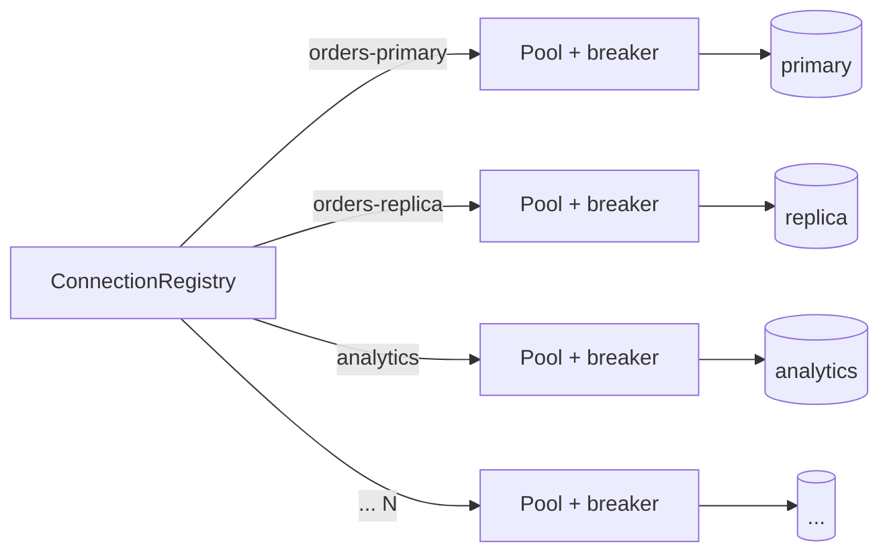
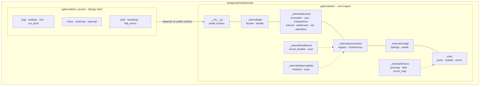
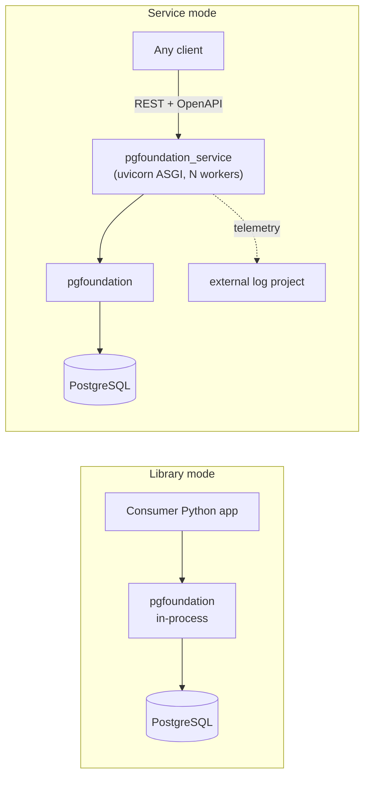

# pgfoundation — Project Diagram

Visual overview of the **PostgreSQL Database Foundation Server**: its packages,
layers, adapters, external systems, request flow, and deployment. See
[HOW-IT-WORKS](./adr/HOW-IT-WORKS.md) for the narrated walkthrough and
[the design docs](./README.md) for rationale.

---

## 1. System architecture

Two packages from one codebase; dependencies point **inward** to a pure core.
Everything at the edges (psycopg, Django, log/auth projects) is a swappable adapter.

---

## 2. Layered dependency rule (inward only)

Enforced in CI by import-linter contracts: the core imports only stdlib; psycopg
lives only in the driver adapter; Django never enters the core library.

---

## 3. Request flow — a governed `POST /view`

A client names a view + filters (no SQL); the foundation compiles safe,
parameterized SQL and runs it through the pooled connection.

---

## 4. Multiple data sources (bulkheads)

Each named data source has its own pool + circuit breaker, so one busy or failing
database cannot starve the others.

---

## 5. Package & module structure

---

## 6. Deployment topology

*Service mode also acts as a **connection concentrator**: a fleet of stateless
service pods shares one bounded pool set, so PostgreSQL sees far fewer backends
than every app pooling independently.*
